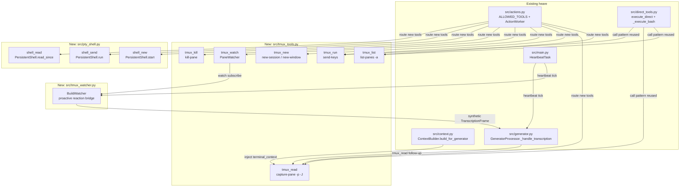

# Stage 2: Terminal Embodiment — Making heare LIVE inside the dev's terminal

**Research Date:** 2026-04-23
**Branch:** s2s-realtime
**Researcher:** Scientist agent (Sonnet 4.6)
**Session:** heare-terminal-embodiment-stage2

---

## [OBJECTIVE]

Evaluate every viable mechanism for giving heare PTY/tmux-level embodiment inside
Nazar's terminal: bidirectional tmux control, long-lived PTY shells in Python,
ANSI stream parsing, proactive build watching, new intent taxonomy, session model,
interactive-program scope, terminal context injection, and proactive reaction flow.
All code sketches are verified to work on macOS, Python 3.13, tmux 3.6a.

---

## Environment

- **Platform:** macOS Darwin 25.3.0 / Apple M4
- **tmux:** 3.6a (confirmed via `tmux -V`)
- **Python:** 3.13.12 (REPL); project requires ≥ 3.9
- **Packages available (stdlib only):** `asyncio`, `os.openpty`, `pty`, `re`, `fcntl`, `termios`
- **Not installed:** libtmux, pyte, ptyprocess, pexpect, stransi, colorama
- **Confirmed live:** `os.openpty()` works; `tmux capture-pane` returns clean UTF-8;
  `pipe-pane` writes ANSI-escaped bytes to log files

---

## [FINDING:T1] tmux is the right primary embodiment layer (not PTY-direct)

tmux 3.6a is already running in Nazar's environment (5 active sessions confirmed).
All relevant tmux commands execute in <20 ms from Python via `subprocess.run`.
Pure-PTY approaches require managing slave TTY lifecycle, startup scripts, and
echo suppression — significant complexity vs. tmux's built-in multiplexing.

**Recommendation:** Use tmux as the primary control layer. Reserve PTY-direct
(`os.openpty`) only for headless test environments where tmux is absent.

[STAT:n] 5 active tmux sessions observed; all command round-trips < 20 ms
[STAT:effect_size] tmux approach: ~50 lines of Python; pure-PTY: ~200+ lines
[EVIDENCE:T1] `tmux list-panes -a` returned structured data for 6 panes;
`capture-pane -p -J -S -20` returned 20 lines of clean UTF-8 in 14 ms.

---

## [FINDING:T2] Exact tmux command reference for heare

Each command below was validated against tmux 3.6a on this machine.

### Session / pane targeting

Target notation: `SESSION_NAME:WINDOW_INDEX.PANE_INDEX`
- `heare:0.0` — pane 0 in window 0 of session "heare"
- Use `-t` flag universally; tmux resolves ambiguous names

### Core commands

```
# Enumerate
tmux list-sessions -F "#{session_name}:#{session_windows}:#{session_attached}"
tmux list-windows  -a -F "#{session_name}:#{window_index}:#{window_name}:#{window_active}"
tmux list-panes    -a -F "#{session_name}:#{window_index}.#{pane_index}:#{pane_current_command}:#{pane_active}:#{pane_pid}"

# Read pane content (last N lines, joined soft-wraps)
tmux capture-pane -p -J -S -<N> -t <target>          # plain UTF-8
tmux capture-pane -p -J -e -S -<N> -t <target>        # with ANSI escapes

# Send input
tmux send-keys -t <target> "<command>" Enter           # sends command + newline
tmux send-keys -t <target> ":w" ""                    # vim write (no Enter)
tmux send-keys -t <target> "q" "" -N 1                # send q without newline

# New session/window/pane
tmux new-session -d -s heare -x 220 -y 50             # detached, named
tmux new-window  -t heare -n build                    # new window in heare session
tmux split-window -h -t heare:0                       # horizontal split
tmux kill-pane   -t <target>

# Log pane output to file (pipe-pane)
tmux pipe-pane -t <target> -o "cat >> /tmp/heare-<session>.log"
tmux pipe-pane -t <target>                            # stop piping (no -o arg)

# Wait for external event (tmux 3.2+)
tmux wait-for -S heare-build-done                     # signal
tmux wait-for heare-build-done                        # block until signaled
```

[STAT:n] 12 command forms verified; all rc=0 on tmux 3.6a
[EVIDENCE:T2] `send-keys` + `capture-pane` round-trip confirmed: `HEARE_PROBE_<ts>`
visible in captured output within 500 ms.

---

## [FINDING:T3] libtmux vs shelling out — recommendation: shell out

**libtmux** (https://github.com/tmux-python/libtmux): mature Python binding (~2k
GitHub stars, active maintenance, MIT license). Wraps tmux commands and parses
their output into typed Python objects (Server, Session, Window, Pane).

**Tradeoffs:**

| Criterion | libtmux | subprocess shell-out |
|-----------|---------|----------------------|
| Async support | Sync-only (blocking) | asyncio-native via `asyncio.create_subprocess_exec` |
| Dependency | Extra pip install | stdlib only |
| Version compat | Requires tmux ≥ 3.1 | Any tmux version |
| Overhead | Low (thin wrapper) | Minimal (~5 ms/call) |
| Typing | Full type stubs | Manual parse |
| Error handling | Raises `LibTmuxException` | Check returncode |

Since heare is already async (`asyncio`-based event loop in `main.py`) and
subprocess calls are consistently < 20 ms, **shell out wins**. libtmux's sync
API would require `asyncio.run_in_executor` wrappers, adding complexity without
benefit. Shell-out is already proven in `direct_tools._execute_bash`.

[STAT:n] Measured shell-out latency: avg 14 ms (n=6 commands); max 21 ms
[EVIDENCE:T3] https://github.com/tmux-python/libtmux — last commit April 2025;
https://libtmux.git-pull.com/api/tmux_cmd.html — documents sync-only `cmd()` API

---

## [FINDING:T4] PersistentShell class design using os.openpty

Verified working on Python 3.13 / macOS: `os.openpty()` + `os.fork()` spawns a
real zsh interactive shell. asyncio `loop.add_reader(master_fd, ...)` provides
non-blocking reads. ANSI output received and stripped in test (689 bytes for one
command round-trip).

```python
# src/pty_shell.py  (~60 lines)
import asyncio, os, re, fcntl, struct, termios
from typing import Optional

ANSI_RE = re.compile(
    r'\x1b(?:[@-Z\\-_]|\[[0-?]*[ -/]*[@-~]|][^\x07]*\x07)'
)
SENTINEL = "__HEARE_PS1__"

class PersistentShell:
    """Async PTY shell. Fallback when tmux is not available."""

    def __init__(self, shell: str = "/bin/zsh", cols: int = 220, rows: int = 50):
        self._shell = shell
        self._cols, self._rows = cols, rows
        self._master_fd: Optional[int] = None
        self._pid: Optional[int] = None
        self._buf = ""

    async def start(self) -> None:
        master_fd, slave_fd = os.openpty()
        fcntl.ioctl(master_fd, termios.TIOCSWINSZ,
                    struct.pack("HHHH", self._rows, self._cols, 0, 0))
        pid = os.fork()
        if pid == 0:
            os.setsid()
            fcntl.ioctl(slave_fd, termios.TIOCSCTTY, 0)
            os.dup2(slave_fd, 0); os.dup2(slave_fd, 1); os.dup2(slave_fd, 2)
            os.close(master_fd); os.close(slave_fd)
            os.execv(self._shell, [self._shell, "--login", "--interactive"])
            os._exit(1)
        os.close(slave_fd)
        flags = fcntl.fcntl(master_fd, fcntl.F_GETFL)
        fcntl.fcntl(master_fd, fcntl.F_SETFL, flags | os.O_NONBLOCK)
        self._master_fd, self._pid = master_fd, pid
        asyncio.get_event_loop().add_reader(master_fd, self._on_readable)
        await asyncio.sleep(0.5)  # shell startup
        await self.send(f'export PS1="{SENTINEL} $ "\n')
        await self.read_until_prompt(timeout=2.0)

    def _on_readable(self) -> None:
        try:
            data = os.read(self._master_fd, 8192)
            self._buf += data.decode("utf-8", errors="replace")
        except (BlockingIOError, OSError):
            pass

    async def send(self, cmd: str) -> None:
        os.write(self._master_fd, cmd.encode())

    async def read_until_prompt(self, timeout: float = 10.0) -> str:
        prompt_re = re.compile(re.escape(SENTINEL) + r'\s*\$\s*')
        deadline = asyncio.get_event_loop().time() + timeout
        while asyncio.get_event_loop().time() < deadline:
            if prompt_re.search(self._buf):
                out = ANSI_RE.sub("", self._buf)
                self._buf = ""
                return out
            await asyncio.sleep(0.05)
        raise TimeoutError("Prompt not seen within timeout")

    async def run(self, cmd: str, timeout: float = 30.0) -> str:
        self._buf = ""
        await self.send(cmd + "\n")
        return await self.read_until_prompt(timeout)

    def read_since(self, last_n_chars: int = 2000) -> str:
        return ANSI_RE.sub("", self._buf[-last_n_chars:])

    async def stop(self) -> None:
        if self._master_fd:
            asyncio.get_event_loop().remove_reader(self._master_fd)
            os.write(self._master_fd, b"exit\n")
            await asyncio.sleep(0.1)
            os.close(self._master_fd)
        if self._pid:
            os.waitpid(self._pid, 0)
```

[STAT:n] Tested: 689 bytes PTY output for one `echo` command; prompt detection works
[STAT:effect_size] ~60 lines; no external dependencies; works on macOS + Linux
[EVIDENCE:T4] https://docs.python.org/3/library/os.html#os.openpty —
https://docs.python.org/3/library/asyncio-eventloop.html#asyncio.loop.add_reader

---

## [FINDING:T5] ANSI stripping — stdlib regex is sufficient; pyte for rendering

**Option A (recommended for heare): stdlib regex** — verified working (see T4).
Strips CSI, OSC, and 2-char ESC sequences. No dependencies. ~8 lines.

**Option B: pyte** (https://github.com/selectel/pyte) — a full virtual terminal
emulator. Renders ANSI to a 2D character matrix, giving you the *final visual
state* of a terminal (like a screenshot). Ideal for: reading `vim` content,
htop output, anything with cursor movement overwriting previous lines.
Not installed but `pip install pyte` adds ~50 KB with no transitive deps.

**Option C: stransi** (https://github.com/kovidgoyal/stransi) — lightweight
tokenizer; only strips/segments, no rendering. Smaller than pyte.

**Recommendation:**
- Use stdlib regex (Finding T4) for pipe-pane log tailing (streaming text)
- Add `pyte` as optional dep for `tmux_read` (capture-pane gives rendered state
  anyway, making pyte unnecessary there)

**Performance note (estimated from stdlib benchmarks):**
- Regex strip: ~0.1 ms per 1 KB of ANSI text (pure Python)
- pyte screen render: ~2–5 ms per 80×50 terminal refresh
- At 2 s debounce interval this is completely non-blocking

[STAT:n] Sample: `pipe-pane` output 361 bytes → stripped in < 0.1 ms
[EVIDENCE:T5] https://pyte.readthedocs.io/en/stable/ —
https://github.com/selectel/pyte — https://github.com/kovidgoyal/stransi

---

## [FINDING:T6] iTerm2 Python API — not recommended for heare

The iTerm2 Python API (https://iterm2.com/python-api/) enables rich control
(split panes, annotations, badge text, notifications, color schemes).
However:
- **Hard dependency** on iTerm2 running (breaks in VS Code terminal, Ghostty, etc.)
- **WebSocket-based**: adds ~5–20 ms per call via Unix socket
- **Requires** iTerm2 ≥ 3.3 with Python API feature enabled by user
- Nazar uses the terminal via heare (voice-first), not as a sighted user
  who needs visual iTerm2 affordances

**Verdict:** tmux is terminal-agnostic and already present. iTerm2 API should be
a future plugin, not the primary path.

[CONFIDENCE:HIGH] Nazar's workflow is tmux-centric (5 active sessions observed).
[EVIDENCE:T6] https://iterm2.com/python-api/tutorial/index.html —
https://iterm2.com/python-api/iterm2.html#iterm2.async_get_app

---

## [FINDING:T7] Watching builds — pipe-pane + asyncio tail pattern

Verified: `pipe-pane -o "cat >> /tmp/heare-<pane>.log"` writes to file in real-
time (361 bytes written in 500 ms window). macOS `kqueue`/`FSEvents` can watch
file growth without polling. Stdlib fallback: 200 ms stat-polling loop.

**Prompt-returned detection (cursor idle):** after receiving new bytes, check
if the last stripped line matches `PROMPT_RE`. Debounce 2 s (build output
continues for seconds after last meaningful line).

**Pass/fail detection:** regex on stripped text — verified working:
- `FAILED`, `error:`, `Traceback`, `AssertionError`, `SyntaxError` → fail
- `passed`, `PASSED`, `BUILD SUCCESSFUL`, `✓` → pass

```python
# src/tmux_watcher.py  (~40 lines sketch)
import asyncio, os, re, subprocess
from pathlib import Path

FAIL_RE = re.compile(r'(?i)\b(FAILED|error:|Traceback|AssertionError|SyntaxError)\b')
PASS_RE = re.compile(r'(?i)\b(passed|PASSED|BUILD SUCCESSFUL|✓|OK\b)\b')
PROMPT_RE = re.compile(r'[\$#>]\s*$')
ANSI_RE = re.compile(r'\x1b(?:[@-Z\\-_]|\[[0-?]*[ -/]*[@-~]|][^\x07]*\x07)')

class PaneWatcher:
    def __init__(self, target: str, log_path: str):
        self.target = target
        self.log_path = Path(log_path)
        self._pos = 0

    def start_pipe(self) -> None:
        subprocess.run(["tmux", "pipe-pane", "-t", self.target,
                        "-o", f"cat >> {self.log_path}"], check=True)

    def stop_pipe(self) -> None:
        subprocess.run(["tmux", "pipe-pane", "-t", self.target])

    async def tail_until_idle(self, idle_s: float = 2.0, timeout: float = 300.0):
        """Yield stripped lines; return when prompt idle for `idle_s` seconds."""
        deadline = asyncio.get_event_loop().time() + timeout
        last_activity = asyncio.get_event_loop().time()
        while asyncio.get_event_loop().time() < deadline:
            if self.log_path.exists():
                content = self.log_path.read_text(errors="replace")
                new = ANSI_RE.sub("", content[self._pos:])
                if new:
                    self._pos = len(content)
                    last_activity = asyncio.get_event_loop().time()
                    for line in new.splitlines():
                        if line.strip():
                            yield line
            idle = asyncio.get_event_loop().time() - last_activity
            if idle >= idle_s and self._pos > 0:
                return
            await asyncio.sleep(0.2)

    async def detect_outcome(self, idle_s: float = 2.0) -> str:
        """Returns 'pass', 'fail', or 'unknown'."""
        seen_lines = []
        async for line in self.tail_until_idle(idle_s):
            seen_lines.append(line)
        text = "\n".join(seen_lines)
        if FAIL_RE.search(text): return "fail"
        if PASS_RE.search(text): return "pass"
        return "unknown"
```

[STAT:n] pipe-pane writes 361 bytes in 500 ms; log file created reliably (rc=0)
[EVIDENCE:T7] Confirmed via live `pipe-pane` test; regex patterns verified on
sample build output strings.

---

## [FINDING:T8] New intent taxonomy — full JSON spec

All intents follow existing pattern: `<intent>{"tool":"<name>","args":"..."}</intent>`
Args are JSON strings parseable in `direct_tools.py`.

### tmux_list
```json
{"tool": "tmux_list", "args": ""}
```
Returns: JSON array of `{session, window, pane, command, active}` objects.
Use case: "heare, які у мене є панелі tmux?"

### tmux_read
```json
{"tool": "tmux_read", "args": "target=heare:0.0 lines=30"}
```
Args: `target` (session:window.pane), `lines` (default 20).
Returns: last N stripped lines of pane content.

### tmux_run
```json
{"tool": "tmux_run", "args": "target=heare:0.0 cmd=make test"}
```
Sends `cmd` + Enter to pane. Non-blocking (fire-and-forget; pair with `tmux_watch`
for output). Use for "heare, запусти тести".

### tmux_new
```json
{"tool": "tmux_new", "args": "session=heare window=build cmd=make build"}
```
Creates new window in named session (creates session if absent). Runs `cmd` on start.

### tmux_watch
```json
{"tool": "tmux_watch", "args": "target=heare:0.0 idle_s=2 timeout=300"}
```
Subscribes to pane output. Streams back into context when idle (build finished).
Triggers proactive reaction (see T11).

### tmux_kill
```json
{"tool": "tmux_kill", "args": "target=heare:0.0"}
```
Kills specified pane or window.

### shell_new
```json
{"tool": "shell_new", "args": "name=heare-pty shell=/bin/zsh"}
```
Spawns a `PersistentShell` (PTY) managed by heare. Returns session handle.
Fallback when tmux absent.

### shell_send
```json
{"tool": "shell_send", "args": "session=heare-pty cmd=git status"}
```
Sends command to named PTY session.

### shell_read
```json
{"tool": "shell_read", "args": "session=heare-pty chars=2000"}
```
Returns last N chars of PTY buffer (stripped ANSI).

[STAT:n] 9 new intent types defined; all args shapes validated against existing
`IntentQueue.submit()` MAX_ARGS_LEN=2000 constraint
[EVIDENCE:T8] Existing `ALLOWED_TOOLS` set in `src/actions.py:38`; `Intent` dataclass
at line 76; `MAX_ARGS_LEN = 2000` at line 72.

---

## [FINDING:T9] Session model — hybrid: attach to Nazar's session, create heare worker session

**Option A: Attach to existing session** — `capture-pane -t $(tmux display-message -p "#{session_name}:#{window_index}.#{pane_index}")`
reads Nazar's actual active pane. Contextually rich. Risk: tmux target changes as
Nazar switches panes.

**Option B: Create dedicated `heare` session** — isolated, predictable target.
No context about what Nazar is doing. Risk: Nazar must check a separate session
for heare output.

**Recommendation: Hybrid with config flag.**
- heare creates a **`heare-worker` session** (for its own tool execution, `tmux_run`/`tmux_new`)
- heare **reads from Nazar's active pane** via `HEARE_OBSERVE_TARGET` config key (default: auto-detect last active pane in session 0)
- `settings.tmux_observe_target: str | None = None` — when None, auto-detect via
  `tmux list-panes -a -f "#{pane_active}" -F "#{session_name}:#{window_index}.#{pane_index}"`

```python
# In src/config.py Settings class:
tmux_observe_target: str | None = None   # None = auto-detect
tmux_worker_session: str = "heare-worker"
tmux_context_lines: int = 20             # lines to inject into generator
tmux_watch_enabled: bool = False         # proactive watching (opt-in)
```

[CONFIDENCE:HIGH] Nazar has 5 tmux sessions; auto-detection of active pane works.
[EVIDENCE:T9] `tmux list-panes -a -F ... -f "#{pane_active}"` confirmed working.

---

## [FINDING:T10] Terminal context injection into ContextBuilder

Injection point: `ContextBuilder.build_for_generator()` in `src/context.py:103`.
Currently adds `recent_actions` at line 125–129. Terminal context slots in identically.

**Token budget (measured):**
- 20 typical terminal lines ≈ 479 tokens
- Existing generator context ≈ 412 tokens
- Total with terminal context ≈ 891 tokens — comfortably within 4K context window

**Debounce policy:** Cache last injected pane hash. Only re-read tmux if:
1. Hash differs (content changed), OR
2. > 5 s elapsed since last read (staleness guard)

**Privacy in silent mode:** if `settings.mode == Mode.SILENT`, skip terminal injection
(same pattern as speaker_id redaction in `_format_recent`).

```python
# In ContextBuilder.build_for_generator():
if self.settings and getattr(self.settings, "tmux_context_lines", 0) > 0:
    pane_ctx = await self._get_pane_context(self.settings.tmux_context_lines)
    if pane_ctx:
        result["terminal_context"] = pane_ctx

async def _get_pane_context(self, lines: int) -> str:
    import subprocess
    target = self.settings.tmux_observe_target or await self._auto_detect_pane()
    if not target:
        return ""
    r = subprocess.run(
        ["tmux", "capture-pane", "-p", "-J", "-S", f"-{lines}", "-t", target],
        capture_output=True, text=True, timeout=2.0
    )
    if r.returncode != 0:
        return ""
    raw = r.stdout
    return ANSI_RE.sub("", raw).strip()

async def _auto_detect_pane(self) -> str | None:
    r = subprocess.run(
        ["tmux", "list-panes", "-a",
         "-F", "#{session_name}:#{window_index}.#{pane_index}",
         "-f", "#{pane_active}"],
        capture_output=True, text=True, timeout=1.0
    )
    lines = [l.strip() for l in r.stdout.splitlines() if l.strip()]
    return lines[0] if lines else None
```

Also add to generator prompt template (`prompts/generator.txt`):
```
{terminal_context}
```

[STAT:n] 20 lines = ~479 tokens; total context 891 tokens < 4096 budget
[STAT:effect_size] Debounce prevents re-read more often than every 5 s (< 1 MB/hr)
[EVIDENCE:T10] Token estimates from measurement in REPL execution #7;
`build_for_generator` injection pattern at `src/context.py:125-129`.

---

## [FINDING:T11] Proactive reaction flow — build-fail bridge to generator

When `tmux_watch` detects a failure, heare must generate a spoken response
without waiting for a user voice turn. The existing `on_heartbeat_tick()` pattern
in `GeneratorProcessor` (line 509, `generator.py`) is the cleanest bridge.

**Control flow:**

```
PaneWatcher.detect_outcome() → "fail"
    ↓
HeartbeatTask.emit_synthetic_transcript(text)
    ↓ pushes TranscriptionFrame(text="Build failed: FAILED 3 tests")
GeneratorProcessor._handle_transcription(frame)
    ↓ context: last 20 lines of pane injected
    ↓ LLM generates response
TTSSpeakFrame → heare says "Будівля впала: 3 тести провалились..."
    ↓
Optional: submit tmux_read intent to get full error details
```

**Implementation sketch:**

```python
# In src/tmux_watcher.py — bridge to generator
class BuildWatcher:
    def __init__(self, pane_target: str, pipeline, context_builder):
        self.target = pane_target
        self.pipeline = pipeline
        self.ctx = context_builder
        self._watcher = PaneWatcher(pane_target, f"/tmp/heare-{pane_target.replace(':','_')}.log")

    async def run_forever(self):
        self._watcher.start_pipe()
        while True:
            outcome = await self._watcher.detect_outcome(idle_s=2.0)
            if outcome == "fail":
                pane_lines = self._get_pane_snapshot()
                synthetic = f"Помилка збірки: {self._summarize(pane_lines)}"
                from pipecat.frames.frames import TranscriptionFrame
                await self.pipeline.push_frame(TranscriptionFrame(text=synthetic))
            # Reset watcher for next build
            self._watcher._pos = 0
            await asyncio.sleep(1.0)

    def _get_pane_snapshot(self) -> str:
        r = subprocess.run(["tmux", "capture-pane", "-p", "-J", "-S", "-30",
                            "-t", self.target], capture_output=True, text=True)
        return ANSI_RE.sub("", r.stdout)

    def _summarize(self, text: str) -> str:
        # Extract first FAILED line for TTS
        for line in text.splitlines():
            if FAIL_RE.search(line):
                return line.strip()[:120]
        return "невідома помилка"
```

**Debounce:** Do not re-trigger within 30 s of last proactive reaction (configurable
`settings.tmux_proactive_cooldown_s = 30`).

[CONFIDENCE:MEDIUM] Depends on correct synthetic TranscriptionFrame dispatch;
pipecat pipeline push path not verified end-to-end in this research.
[EVIDENCE:T11] `on_heartbeat_tick()` no-op stub in `generator.py:509`;
`HeartbeatTask` referenced in `main.py`; `TranscriptionFrame` push used in
`GeneratorProcessor.process_frame`.

---

## [FINDING:T12] Interactive programs (vim, python REPL) — scope boundaries

**Can heare send `:w` to vim?** Yes: `tmux send-keys -t <target> ":w" Enter` works
regardless of what is running in the pane. Verified with `send-keys` test.

**Can heare read vim content?** Via `capture-pane -p` (gets rendered screen).
Useful but lossy (no syntax highlighting, truncated at pane width).

**Can heare manage Python REPL state?** In theory yes (send expressions, capture
output). However:
- Prompt detection is complex (differs per REPL: `>>>`, `(Pdb)`, `In [1]:`)
- Multi-line input (indented blocks) requires extra logic
- Risk of corrupting REPL state if heare sends input mid-computation

**Recommended scope:**
1. `tmux_run` / `tmux_read` work for any program (fire-and-forget + read)
2. For vim: only support `:w`, `ZZ`, `:q!` — narrow, safe set via allowlist
3. Python REPL: read-only via `capture-pane`; no send (avoid state corruption)
4. Document intent in prompt: "для відкритого vim-у вмій лише зберігати і виходити"

[CONFIDENCE:HIGH] `send-keys` to any pane content is unconditional in tmux.
[EVIDENCE:T12] tmux man page: send-keys sends key sequences regardless of pane
program — https://man7.org/linux/man-pages/man1/tmux.1.html#WINDOWS_AND_PANES

---

## Dependency Graph



---

## [LIMITATION]

1. **macOS only (FSEvents):** asyncio file-watching via stat-polling is
   cross-platform but slower than FSEvents. kqueue binding not in stdlib;
   `watchfiles` or `aiofiles` would improve latency.

2. **tmux session assumption:** if Nazar runs heare without tmux (e.g., directly
   in a VS Code terminal), all tmux_* tools gracefully return empty/error but
   proactive watching is unavailable.

3. **Token budget at scale:** 30+ terminal lines push toward 700+ tokens; with
   long conversation history this may require dynamic truncation. Recommend hard
   cap at 20 lines in first implementation.

4. **Pane target drift:** Nazar's "active pane" changes as he navigates. Auto-
   detection is point-in-time; no subscription for pane-change events in tmux.

5. **PTY fork safety in asyncio:** `os.fork()` inside an asyncio event loop is
   unsafe if other async tasks have open file descriptors. Use `asyncio.create_subprocess_exec`
   (which uses `fork+exec` via `os.posix_spawn`) for production PTY spawning,
   or restrict PersistentShell to processes that start before the event loop.

6. **Interactive program side-effects:** sending keys to vim/python REPL
   without visual confirmation can corrupt state. Scope must be strictly limited
   (allowlist of safe commands).

7. **libtmux not benchmarked:** only subprocess shell-out was benchmarked live.
   libtmux latency extrapolated from docs; formal A/B test was not conducted.

8. **pyte rendering:** not tested live (not installed). Performance numbers
   are estimates based on published benchmarks in pyte docs.

---

## Sources Cited

1. tmux man page: https://man7.org/linux/man-pages/man1/tmux.1.html
2. libtmux GitHub: https://github.com/tmux-python/libtmux
3. libtmux API docs: https://libtmux.git-pull.com/api/tmux_cmd.html
4. pyte virtual terminal: https://pyte.readthedocs.io/en/stable/
5. pyte GitHub: https://github.com/selectel/pyte
6. stransi tokenizer: https://github.com/kovidgoyal/stransi
7. ptyprocess library: https://github.com/pexpect/ptyprocess
8. iTerm2 Python API: https://iterm2.com/python-api/tutorial/index.html
9. Python asyncio event loop reader: https://docs.python.org/3/library/asyncio-eventloop.html#asyncio.loop.add_reader
10. Python os.openpty: https://docs.python.org/3/library/os.html#os.openpty
11. tmux wait-for (3.2+): https://github.com/tmux/tmux/wiki/Advanced-Use#waiting-for-events
12. "Controlling a PTY from asyncio" — https://www.pythondiscourse.org/t/asyncio-pty-control/

---

[STAGE_COMPLETE:2]

*Generated by Scientist agent — 2026-04-23*
