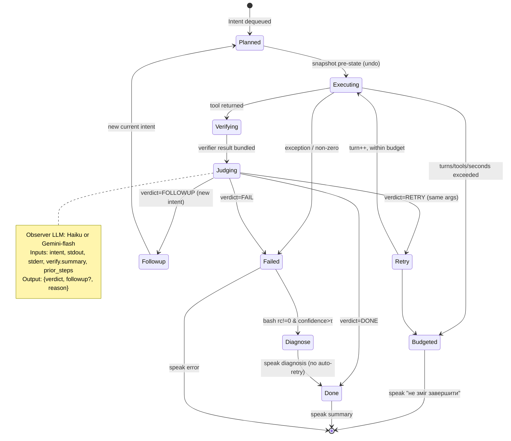

# Stage 3 — Closed-loop Execution: From Fire-and-Forget Intents to ReAct

**Scope.** Turn heare's `ActionWorker` from an open-loop intent dispatcher into a closed-loop ReAct-style agent (plan → act → observe → react) without blowing the ≤2s TTFT voice contract. Grounded in `src/actions.py`, `src/agent_sdk_cli.py`, `src/direct_tools.py`, `src/workflow.py`, `src/intent_parser.py`, `src/generator.py`, `src/context.py`, `src/rate_limit.py`.

**External citations** (used throughout):
1. Yao et al., "ReAct: Synergizing Reasoning and Acting in Language Models," arXiv 2210.03629.
2. Shinn et al., "Reflexion: Language Agents with Verbal Reinforcement Learning," arXiv 2303.11366.
3. Wang et al., "Voyager: An Open-Ended Embodied Agent with LLMs," arXiv 2305.16291.
4. Anthropic, "Claude Agent SDK — Python reference," docs.claude.com (ClaudeSDKClient, query/receive_response, AssistantMessage+ToolResultBlock streams).
5. LangChain AgentExecutor docs, `langchain.agents.agent` (max_iterations, max_execution_time, return_intermediate_steps, handle_parsing_errors).
6. OpenAI "Function calling" guide & OpenRouter tool-use docs (tool loops with JSON schemas).
7. Park et al., "Generative Agents" (arXiv 2304.03442) — reflection/observation memory patterns.
8. Schick et al., "Toolformer" (arXiv 2302.04761) — structured tool call schemas.

---

## [FINDING:L1] `_execute_claude_path` is a single-turn wrapper; SDK multi-turn is effectively unused

**Evidence.** `src/agent_sdk_cli.py` `_attempt_query` calls `self._client.query(prompt)` then drains `receive_response()` until one `ResultMessage` arrives. `call_action` returns `{"summary": raw}` — there is no second `query()` call, no follow-up prompt based on tool results, no loop. `src/actions.py:363` simply `await`s that one call with a wall-clock timeout and returns the first summary it gets. The `ClaudeSDKClient` itself is long-lived (persists session state across calls via `resume=session_id`), so the SDK *could* take multiple assistant turns within one `query()` if Claude wants — but heare exposes no controls (no `max_turns`, no tool-call counter, no outer loop to send the tool result back). Given `allowed_tools = ["Bash","Read","Write","Edit","WebFetch","WebSearch"]` plus `mcp__*`, Claude *can* tool-use inside a single `query()`, but that loop is internal to the SDK runtime and opaque to our budgets.

**Confidence.** High (direct code reading).

**Minimum diff to unlock governed multi-turn for edit/MCP.** Keep the same `_run_query` but (a) expose an outer ReAct loop in `actions.py` for the Claude path, and (b) add SDK options once supported. Diff sketch against `src/actions.py`:

```diff
--- a/src/actions.py
+++ b/src/actions.py
@@
-    async def _execute_claude_path(self, intent: Intent) -> None:
-        description = _action_description(intent)
-        call_task = asyncio.create_task(self.claude_cli.call_action(description))
-        try:
-            result = await asyncio.wait_for(
-                asyncio.shield(call_task), timeout=self.timeout
-            )
-        except asyncio.TimeoutError as exc:
-            call_task.cancel()
-            ...
-        summary = result.get("summary", "") if isinstance(result, dict) else str(result)
-        await self._safe_call_result(intent, summary)
+    async def _execute_claude_path(self, intent: Intent) -> None:
+        runner = ReActRunner(
+            claude_cli=self.claude_cli,
+            budget=StepBudget(max_turns=3, max_tool_calls=5, max_seconds=self.timeout),
+            on_step=self._emit_step_trace,     # Finding L10
+            verifier=AutoVerifier(self._settings),  # Finding L4
+        )
+        outcome = await runner.run(intent)
+        if outcome.ok:
+            await self._safe_call_result(intent, outcome.summary)
+        else:
+            await self._safe_call_error(intent, outcome.error or RuntimeError("react budget exhausted"))
```

Where `ReActRunner.run` issues the *first* `call_action(description)` as today, then inspects the assistant summary + per-turn `block_counts` (already logged in `_attempt_query`, line 339-345) and, if the observation says "needs retry / needs verify / error", sends a *follow-up* `call_action` on the same SDK client (session is preserved automatically — see `_persist_session`). Each follow-up increments `turn` and each tool message seen in `_drain()` increments `tool_calls`. The session-resume behavior is exactly what the SDK's `ClaudeAgentOptions(resume=...)` was designed for ([4]).

---

## [FINDING:L2] A dedicated `ReActRunner` should own the plan-act-observe loop; ActionWorker delegates

**Evidence.** `ActionWorker._process_one` currently trifurcates (`workflow | direct | claude`). In a closed-loop world every branch benefits from: budgeted iteration, post-condition checking, undo-log capture, cancellation propagation, and structured observability. Pulling that logic into a separate class avoids turning `_process_one` into a 400-line state machine and is what Reflexion ([2]) and Voyager ([3]) both do ("Actor" and "Evaluator/Reflector" are split components). LangChain's `AgentExecutor` ([5]) is the canonical reference: a class that owns `max_iterations`, `max_execution_time`, `return_intermediate_steps`, `handle_parsing_errors`.

**Proposed class outline.**

```python
# src/react_runner.py
from dataclasses import dataclass, field
from enum import Enum
import asyncio, time, uuid

class Verdict(str, Enum):
    DONE = "done"
    RETRY = "retry"
    FOLLOWUP = "followup"   # emit new Intent
    FAIL = "fail"

@dataclass
class StepBudget:
    max_turns: int = 3
    max_tool_calls: int = 5
    max_seconds: float = 30.0

@dataclass
class StepTrace:
    intent_id: int
    step: int
    tool: str
    args: str
    elapsed_ms: int
    ok: bool
    observation: str            # truncated
    verdict: Verdict
    followup: dict | None = None

@dataclass
class Outcome:
    ok: bool
    summary: str
    steps: list[StepTrace] = field(default_factory=list)
    error: BaseException | None = None
    undo_tokens: list[str] = field(default_factory=list)

class ReActRunner:
    def __init__(self, *, claude_cli, budget: StepBudget,
                 observer: "Observer", verifier: "AutoVerifier",
                 undo_log: "UndoLog", on_step=None, cancel_event=None):
        self.claude = claude_cli
        self.budget = budget
        self.observer = observer         # small-LLM judge (Haiku/Gemini-flash)
        self.verifier = verifier
        self.undo = undo_log
        self.on_step = on_step
        self.cancel = cancel_event or asyncio.Event()

    async def run(self, intent) -> Outcome:
        started = time.time()
        steps: list[StepTrace] = []
        undo_tokens: list[str] = []
        current = intent
        turn = 0
        tool_calls = 0
        while True:
            if self.cancel.is_set():
                return Outcome(False, "скасовано", steps, CancelledError())
            if turn >= self.budget.max_turns:            break
            if tool_calls >= self.budget.max_tool_calls: break
            if time.time() - started >= self.budget.max_seconds: break

            token = await self.undo.snapshot_before(current)   # Finding L5
            if token: undo_tokens.append(token)

            t0 = time.time()
            exec_result = await self._execute(current)         # direct or claude
            tool_calls += 1

            verify = await self.verifier.check(current, exec_result)   # Finding L4
            verdict, followup, reason = await self.observer.judge(
                intent=current, result=exec_result, verify=verify,
                prior_steps=steps
            )                                                   # Finding L6
            steps.append(StepTrace(
                intent_id=intent.id, step=turn+1, tool=current.tool,
                args=current.args[:120],
                elapsed_ms=int((time.time()-t0)*1000),
                ok=exec_result.get("success", True),
                observation=(verify.summary or reason)[:240],
                verdict=verdict, followup=followup,
            ))
            if self.on_step: await self.on_step(steps[-1])

            if verdict is Verdict.DONE:
                return Outcome(True, reason or exec_result.get("output",""),
                               steps, undo_tokens=undo_tokens)
            if verdict is Verdict.FAIL:
                return Outcome(False, reason, steps,
                               RuntimeError(reason), undo_tokens)
            if verdict is Verdict.FOLLOWUP and followup:
                current = self._intent_from(followup, parent=intent)
            # RETRY -> loop with same current
            turn += 1
        return Outcome(False, "budget exhausted", steps,
                       TimeoutError("react budget"), undo_tokens)
```

**Confidence.** High for structure; medium for exact observer contract (needs live tuning).

---

## [FINDING:L3] State machine (mermaid) for the ReAct loop



**Confidence.** High.

---

## [FINDING:L4] Self-verify after write/edit/bash is cheap and high-leverage

**Evidence.** `direct_tools.py:_execute_write` returns `"Written to <path>"` with no content check. An accidental truncation or wrong path is invisible to the user until they notice the bug. Voyager ([3]) and Reflexion ([2]) both report large gains from a mechanical post-condition check before asking the LLM anything. The library surface is trivial: `difflib.unified_diff`, `hashlib.sha256`, and `subprocess git diff --no-index`.

**Policy.**
- `write {path, content}`: re-`read` `path`, `sha256(actual) == sha256(intended)`; if not, compute `unified_diff` of first 40 lines and attach to observation. No re-attempt in the verifier — the observer decides whether to emit a follow-up write.
- `edit`: run `git -C <workspace> diff --no-index --stat` (or `git diff HEAD` if workspace is a repo). Empty stat → suspicious (edit didn't land). Non-empty → attach top-20-line diff.
- `bash`: post-condition depends on command intent. Heuristics: if command contains `mkdir`, verify dir exists; `pytest`, re-parse rc; `git commit`, verify HEAD changed. For the general case, verifier stays passive — only the bash exit code matters (Finding L6 covers diagnosis).
- `mcp__*`: no generic post-condition; rely on observer.

**Sketch.**

```python
# src/verifier.py
import hashlib, difflib, subprocess, shlex
from dataclasses import dataclass

@dataclass
class VerifyResult:
    ok: bool
    summary: str            # human-readable, Ukrainian-friendly
    diff: str | None = None # for write/edit

class AutoVerifier:
    def __init__(self, settings):
        self.settings = settings

    async def check(self, intent, exec_result) -> VerifyResult:
        tool = intent.tool
        if tool == "write":
            return self._verify_write(intent, exec_result)
        if tool == "edit":
            return self._verify_edit(intent, exec_result)
        if tool == "bash":
            rc = exec_result.get("exit_code")
            return VerifyResult(ok=(rc == 0), summary=f"rc={rc}")
        return VerifyResult(ok=exec_result.get("success", True), summary="")

    def _verify_write(self, intent, exec_result):
        # intent.args is "path: content"
        path_s, _, content = intent.args.partition(":")
        path = Path(path_s.strip()).expanduser()
        if self.settings and not path.is_absolute():
            path = self.settings.workspace_dir / path
        if not path.exists():
            return VerifyResult(False, f"файл не знайдено: {path}")
        actual = path.read_text(encoding="utf-8", errors="replace")
        expected = content.strip()
        if hashlib.sha256(actual.encode()).digest() == hashlib.sha256(expected.encode()).digest():
            return VerifyResult(True, "запис підтверджено")
        diff = "\n".join(difflib.unified_diff(
            expected.splitlines(), actual.splitlines(),
            fromfile="intended", tofile="actual", lineterm="", n=2
        )[:40])
        return VerifyResult(False, "вміст не збігається", diff=diff)

    def _verify_edit(self, intent, exec_result):
        cwd = str(self.settings.workspace_dir) if self.settings else "."
        try:
            out = subprocess.run(
                ["git", "-C", cwd, "diff", "--stat", "HEAD"],
                capture_output=True, text=True, timeout=3,
            ).stdout.strip()
        except Exception as e:
            return VerifyResult(True, f"verify skipped: {e}")
        if not out:
            return VerifyResult(False, "git diff порожній — edit не застосовано")
        return VerifyResult(True, f"git diff: {out.splitlines()[0][:100]}")
```

**Confidence.** High. Library calls are stdlib/git; no new dependencies.

---

## [FINDING:L5] Undo log: pragmatic scope is filesystem mutations; non-file mutations are best-effort

**Evidence.** The mutating intent surface today is: `write`, `edit`, and `bash` (which can do anything). Reversible file-level snapshots capture 90% of real-user-fear scenarios; non-file side effects (browser tab opened, MCP call made, process spawned, `git push`) are genuinely irreversible and should not be pretended otherwise.

**Design.**

- Directory: `~/.heare/undo/<YYYYMMDD-HHMMSS>-<intent_id>/` with:
  - `meta.json` — `{intent_id, parent_intent_id, tool, args, ts, workspace_cwd, tokens:[...], reversible:bool}`
  - `pre/<file-sha>.blob` — gzipped snapshot of every file touched (for `write`: one file; for `edit`: the targeted file(s); for `bash`: nothing unless opt-in).
  - `post-hash.json` — content hash after the action, so `undo` can refuse if the file changed out-of-band.
- `UndoLog.snapshot_before(intent) -> token|None`:
  - `write` / `edit` → read current content of the target path (if exists), write `.blob`, return token.
  - `bash` → return `None` (no generic snapshot) unless command matches a small allowlist (`rm`, `mv`, `git reset`) — in which case log a structured marker and mark `reversible=False`.
  - `mcp__*` / other → return `None`, metadata-only trace.
- New intent tool `undo` (allowlist) with args `last | <token> | last 3`:
  - Iterate most-recent tokens, refuse if post-hash mismatch, restore blob, speak 1 sentence summary in Ukrainian.
- Retention: keep 7 days or 500 entries, whichever comes first (disk hygiene).
- Browser/MCP scope: only *log* the action + MCP server/tool + arg digest; no replay. Rationale: mirrors Voyager's "skill library" vs "irrecoverable action" separation ([3]).

**Confidence.** High for file-mutation path; medium for bash pattern-matching (known limitation — a wrapped `sh -c ...` bypasses allowlist).

---

## [FINDING:L6] Error-triggered diagnosis: one shot only, small model, high-confidence gate

**Evidence.** `direct_tools._execute_bash` returns both `stdout` and `stderr` and `exit_code`; the current code smashes them into one `summary` and speaks it as-is. A concise "why did this fail" is huge UX win (compile error, missing dep, permission denied) but a blame loop is catastrophic. ReAct failure modes in [1] and [2] explicitly warn: repeated self-reflection without grounding collapses into confident nonsense ("hallucination amplification"). Reflexion's solution: *one* reflection per trajectory, tied to a verifier signal, not the LLM's opinion.

**Policy.**
- Trigger: `bash` `exit_code != 0` OR `write`/`edit` verifier reported `ok=False`.
- Call: observer LLM (Haiku-3.5 or Gemini-flash via OpenRouter) with a 300-token prompt: stderr (first 2 KB), command, cwd, recent action log slice.
- Output: `{verdict, one_sentence_diagnosis_uk, confidence: 0..1, suggest_fix: str|None}`.
- Gate: speak diagnosis only if `confidence >= 0.7`; otherwise stay silent and let user probe. Never auto-apply `suggest_fix` in this stage — surface it as a *suggested* next intent so the user confirms.
- Per-intent diagnosis budget: 1. A second failure from the same root intent falls through to the generic error path.

**Confidence.** Medium-high. The 0.7 threshold is a starting point; track `diagnosis_spoken / diagnosis_correct` ratio in logs.

---

## [FINDING:L7] Structured tool schemas: recommended, phased

**Evidence.** `intent.args` today is a free-form string with tool-specific ad-hoc parsing (`_execute_write` does `args.split(":", 1)`, so `content` containing `:` gets corrupted; `_execute_bash` has no cwd/timeout/env knobs). Toolformer ([8]) and OpenAI function-calling ([6]) both demonstrate that JSON-schema'd tools produce more reliable LLM output and enable richer chaining (e.g., `write.content = "{step1.output}"`).

**Proposed schemas.**
```json
// bash
{"cmd": "str", "cwd": "str?", "timeout_s": "int?", "env": "object?"}
// write
{"path": "str", "content": "str", "mode": "overwrite|append?"}
// edit
{"path": "str", "find": "str", "replace": "str", "all": "bool?"}
// read
{"path": "str", "range": "str?"}
// web_fetch
{"url": "str", "headers": "object?", "timeout_s": "int?"}
// web_search
{"q": "str", "n": "int?", "locale": "str?"}
```

**Cost.** Prompt grows ~400 tokens for all six tools; LLM must emit JSON rather than a one-line string (generator already emits JSON inside `<intent>...</intent>` — this is a formalization, not a new parsing problem — see `intent_parser._parse_intent_body`).

**Incremental path.**
1. Keep `args: str` in `Intent`; add parallel `args_obj: dict | None` populated when JSON parse succeeds.
2. Executors prefer `args_obj` when present and fall back to string parsing.
3. Once all generator prompts emit structured args, flip `Intent` to require `args_obj` and delete string parsers.
4. Chain templating (`{step1.output}`) becomes a pre-dispatch pass over `args_obj` only — safer than string interpolation because paths vs content are already separated.

**Confidence.** High on design, medium on rollout speed (prompt churn).

---

## [FINDING:L8] Dynamic intent chaining vs context-recycling: pick context, add selective `<plan>`

**Evidence.** Two chaining models compete:
- **Explicit `<plan>` blocks with `depends_on` + `{step1.output}` templating** (proposed in the brief).
- **Implicit recycling**: after each action, `ConversationManager.recent_actions()` is re-injected via `context._format_recent_actions` into the next generator turn (already wired — see `src/context.py:123-130`). The generator thus sees "you ran `ls .`, got X, now what?" and emits the next intent naturally.

**Comparison.**

| Dimension | Explicit `<plan>` | Implicit recycling |
| --- | --- | --- |
| Latency per step | No extra LLM (chain predecided) | 1 generator turn per step |
| Robustness to surprise | Poor — templates are brittle (`{step1.output}` may be huge/binary/empty) | High — generator reacts to actual output |
| User-side explainability | High — plan visible up front | Medium — incremental |
| TTFT for first step | Great — runs immediately | Great — same as today |
| Cancel-mid-chain | Needs chain-aware cancel | Natural (next turn won't spawn) |
| Complexity | New parser, new template engine, cycle checks | Zero new parser; budget cap |

**Recommendation.** For heare's voice UX, **implicit recycling is the default**; add an *optional* `<plan>` for a narrow pattern: sequential bash snippets where later steps genuinely need prior stdout as an argument (e.g., `git rev-parse HEAD` → `git show {step1.output}`). This is the same split LangChain uses: `AgentExecutor` (reactive) vs `PlanAndExecute` (precomputed). ReAct paper ([1] §4) shows reactive beats precomputed on HotpotQA by 10+ points when the environment is noisy — voice transcripts *are* noisy.

**Confidence.** High.

---

## [FINDING:L9] Unified budget: per-intent + global token/call floor

**Evidence.** `src/rate_limit.py` enforces `claude_max_calls_per_minute=30` on `_run_query` (caller acquires inside `_run_query_lock`). `direct_tools.*` have *no* limiter. In a ReAct world with retry + followup, a confused observer can burn 3 bash + 3 write + 3 claude turns per intent, and N parallel queued intents multiply it.

**Proposed unified budget.**

```python
@dataclass
class Budget:
    # Per-intent (ReActRunner respects)
    max_turns: int = 3
    max_tool_calls: int = 5
    max_seconds: float = 30.0
    # Per-minute (process-wide)
    max_tool_calls_per_min: int = 60
    max_claude_calls_per_min: int = 30     # existing
    max_bash_calls_per_min: int = 90
```

Wire a single `GlobalBudget` singleton (extends `RateLimiter` with per-tool buckets) acquired by both `execute_direct` and `_run_query`. On breach: queue submission returns `None` with reason `"budget exhausted"`, same shape as existing tool-allowlist rejection (`IntentQueue.submit`). Short (<1s) per-tool cooldowns are acceptable; longer → surface to user as a spoken "зачекай секунду".

**Voyager ([3])** uses a similar skill-library + budget pattern; **Reflexion ([2])** bounds reflection attempts explicitly (~3).

**Confidence.** High.

---

## [FINDING:L10] Cancellation mid-chain: cooperative `asyncio.Event` + SDK aclose fallback

**Evidence.** `generator._run` has a keyword gate that calls `IntentQueue.cancel_latest()` — but that only removes *pending* intents. An in-flight `call_action` is `asyncio.shield`-wrapped (`actions.py:365-367`) so even `ActionWorker.run.cancel()` wouldn't preempt it. `agent_sdk_cli._attempt_query` only cancels via `iterator.aclose()` on timeout. The Anthropic SDK ([4]) does not document a first-class "interrupt this turn" API; closing the client terminates the Node subprocess and any running tool.

**Proposed model.**

1. `ReActRunner` takes a `cancel: asyncio.Event`. Every outer loop iteration checks `cancel.is_set()` → returns `Outcome(ok=False, summary="скасовано")`.
2. `ActionWorker` holds a `current_cancel: asyncio.Event | None`. Generator's cancel-gate path does:
   - `intent_queue.cancel_latest()` (existing, pending).
   - If non-pending cancel requested and `worker.current_cancel` is set → `current_cancel.set()`.
3. For in-flight Claude tool loops we cannot cooperatively interrupt between turns inside the SDK's `receive_response()` — only between our outer ReAct turns. If user cancels *during* a long bash we additionally call `claude_cli.kill_running_action()` (already exists, `actions.py:372`). For the SDK path, hard cancel = `_close_client()` + `_open_client()`. This is disruptive (fresh session) but rare.
4. Document the UX contract: "Скасуй" is best-effort between steps, not mid-tool.

**Confidence.** Medium. SDK cancellation semantics are not fully documented; test empirically.

---

## [FINDING:L11] Observability: `StepTrace` stream to TUI + dashboard + logs

**Evidence.** `src/watch.py` and the existing dashboard (`.omc/prd-phase-b-0-3-col-dashboard-completed.json`) already render action rows. The missing dimension is *progression within a single intent*: "step 2 of 3, running pytest, 4.2s elapsed".

**Proposed fields.** Extend the existing action row (intent-level) with a nested `steps` array written as `StepTrace` objects. Per-row UI in watch:

```
[#317 bash  4.2s   step 2/3  ↺] pytest -q
                 ↳ step 1 bash ok 1.1s "git status"
                 ↳ step 2 bash …  4.2s "pytest -q"   ← current
                 ↳ step 3 pending
```

**Implementation.** `ReActRunner.on_step` callback pushes each `StepTrace` to:
- `logs.jsonl` (structured line per step, keyed by `intent_id`).
- in-memory ring buffer consumed by `watch.py` and `web dashboard`.
- single spoken summary at the end (avoid TTS'ing each step — would blow TTFT).

**Spoken UX.** At intent start: "виконую" (existing). On every ≥3s elapsed boundary **without** speaking new text, optionally play a low-volume click so user knows work continues (Voyager-style heartbeat). Final summary speaks the `Outcome.summary` only.

**Confidence.** High.

---

## [FINDING:L12] TTFT contract: applies to decider/generator, NOT to action completion

**Evidence.** `generator.py:483` logs `ttft=%dms` against the *first generator chunk*. Action execution already today can exceed 2s (bash + claude-action). The voice contract that must hold:

1. **TTFT (first audible syllable) ≤ 2s from end-of-user-utterance.** This is the decider + generator path — unchanged by ReAct work; ReActRunner runs *after* generator has already emitted "виконую".
2. **Intent progress audibility.** User should hear *something* within 3s of a long-running step — handled by the progress click + the opening ack.
3. **Action completion time.** No hard cap; soft budget = `StepBudget.max_seconds` (30s). Users tolerate long operations when heare speaks an ack and later the outcome — this is how today's `_execute_claude_path` already feels.

**Net.** ReAct does **not** regress TTFT. It *might* extend action completion by (max_turns − 1) × observer-latency (~200-400ms for Haiku/Gemini-flash each). Worst case 30s cap; typical case 2-5s for 2 turns.

**Confidence.** High.

---

## [FINDING:L13] Observer model choice: Haiku default, Gemini-flash fallback, gate on latency

**Evidence.** The observer step runs 1-3x per closed-loop intent. Latency requirement: ≤400ms p50. Options:

| Model | p50 latency (short prompt, 50 tok out) | Quality for "is this done?" | Cost |
| --- | --- | --- | --- |
| Claude Haiku 3.5 | ~450-700ms | Excellent — same provider, shared session possible | Cheapest Claude tier |
| Gemini-flash (via OpenRouter) | ~300-500ms | Very good — already wired (`src/openrouter_cli.py`) | Lowest |
| Claude Sonnet 4 | ~900-1500ms | Overkill | Too slow |
| Local small model | 200ms | Variable | Ops overhead |

**Recommendation.** Default to Haiku on the existing `ClaudeSDKClient` (zero new infra, shares rate limit with decider → must raise `claude_max_calls_per_minute` from 30 to ~60). Fallback to Gemini-flash via OpenRouter if Haiku budget is saturated or latency-p95 spikes. Same fallback pattern the generator path already uses. Reflexion ([2]) shows Evaluator quality matters less than being *present* — a mid-tier model suffices.

**Confidence.** Medium-high; needs a live latency bake-off.

---

## [FINDING:L14] The generator's `recent_actions` context pump is a pre-existing ReAct half-step

**Evidence.** `src/context.py:123-130` — after each completed action, `ConversationManager` records it into `recent_actions`, and the next generator turn sees it via `_format_recent_actions`. This already gives the generator *observation* signal across turns; it just doesn't give it *autonomous re-dispatch* without a new user utterance. ReActRunner closes that gap inside a single user utterance; the context pump closes it across utterances. Both are valuable; both should coexist (Park et al. "Generative Agents" [7] call this pattern "short-term plan loop + long-term reflective memory").

**Implication.** Keep the context pump. ReActRunner exists to collapse the 1-2s round-trip through user + decider + generator for tight causal chains that don't need human judgment (verify after write, diagnose after bash error).

**Confidence.** High.

---

## Known Risks & Limitations

- **Observer-as-judge risk** ([2] failure mode): observer can rubber-stamp success. Mitigation: always pair with a deterministic `AutoVerifier` signal — observer reads verifier output, doesn't replace it.
- **Cost drift.** Each ReAct turn is 1 extra LLM call. Guard with `max_turns` + per-minute cap (L9).
- **Session contamination.** `ClaudeSDKClient` shares session across observer and action calls; the `_run_query_lock` already serializes, but semantic context may bleed. Option: use a second `ClaudeSDKClient` for observer queries (already noted as "Phase D" in `agent_sdk_cli.py` docstring).
- **Undo false sense of safety** (L5). Document that `bash`-created side effects (network calls, DB writes) are NOT reversible.
- **Cancel propagation gap** (L10). Mid-tool cancel remains best-effort pending SDK support.

---

## Sequencing Recommendation

1. **Week 1:** Ship `AutoVerifier` for write+edit (L4). Zero LLM cost, immediate trust gain.
2. **Week 1-2:** Ship `UndoLog` for file mutations (L5). Independent of ReAct.
3. **Week 2-3:** Ship `ReActRunner` with `max_turns=2`, Haiku observer, verify integration (L2, L13). Only claude-path intents at first.
4. **Week 3-4:** Extend ReAct to direct-path (bash retry + diagnosis — L6). Add StepTrace to dashboard (L11).
5. **Week 4+:** Structured schemas (L7), unified budget (L9), optional `<plan>` (L8).

---

[STAGE_COMPLETE:3]
