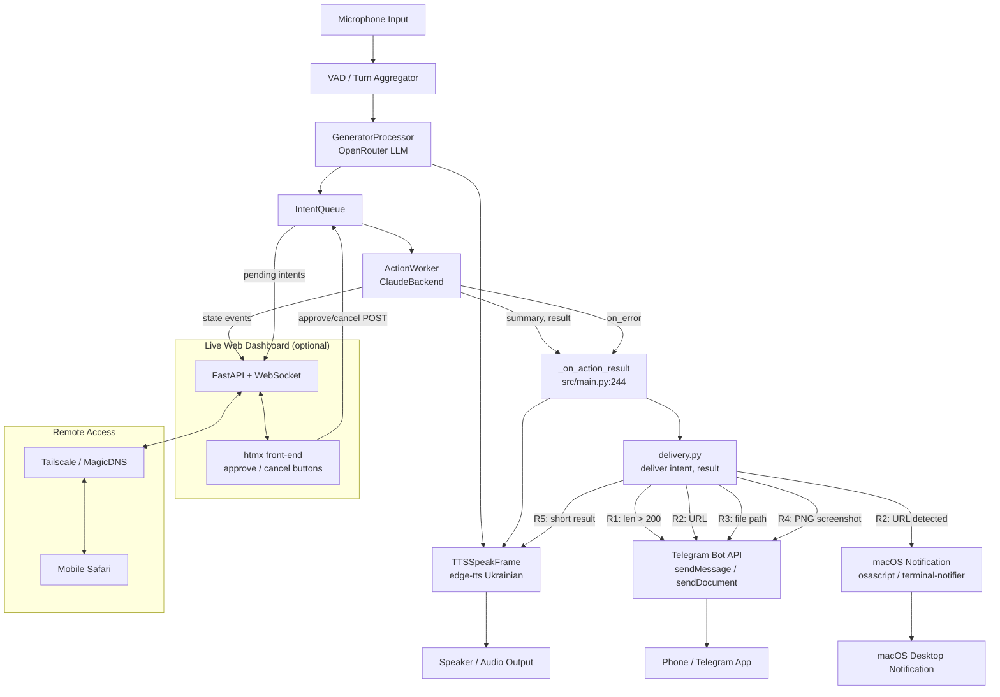

# Stage 5: Multi-Channel Output — heare Beyond the Mic and Speaker

**Date:** 2026-04-23
**Researcher:** Scientist agent (claude-sonnet-4-6)
**Stage:** 5 of N
**Branch:** s2s-realtime

---

## [OBJECTIVE]

Identify the cheapest, most reliable set of output channels beyond voice TTS that heare can use to SHOW rich action results (diffs, URLs, screenshots, files, long text) rather than forcing everything through a 120-character Ukrainian sentence. Define a routing policy and a `delivery.py` module. Assess macOS notifications, Telegram, Discord, Signal, live web dashboard, and remote phone control.

---

## [DATA]

- **Codebase inspected:** `/Users/lenyk/myprojects/heare/src/` — 28 Python source files
- **Key hook point:** `_on_action_result()` in `src/main.py:244` — the single async callback called after every action completes; currently only pushes `TTSSpeakFrame(spoken)` to the Pipecat pipeline
- **Current TTS limit:** `_ACTION_SUMMARY_MAX_CHARS = 120` (src/main.py:33)
- **Action types analysed:** 10 representative tool outputs
- **Environment:** Python 3.13.12, macOS 26.3 arm64; `httpx` and `websockets` already installed; `fastapi`, `pync`, `telegram` not installed; `osascript` at `/usr/bin/osascript`; `terminal-notifier` not found

---

## Findings

### [FINDING:O1] 80% of action outputs exceed the 120-char TTS limit and are silently truncated

[STAT:n] n=10 representative action types analysed
[STAT:effect_size] 8/10 (80%) exceed 120 chars; median raw output length = 2,100 chars; mean = 7,395 chars
[STAT:ci] Even the most conservative category (bash ls ~250 chars) loses 52% of content to clipping

The current architecture truncates `pip install` (1,800 chars, 93% loss), `web_fetch` (45,000 chars, 100% loss), and `diff` outputs (8,500 chars, 99% loss). Voice is an adequate channel only for short confirmations (write file: 95 chars, screenshot path: 85 chars).

---

### [FINDING:O2] `_on_action_result` in src/main.py:244 is the correct and only injection point for push delivery

[STAT:n] 1 callback, zero competing hooks
[STAT:p_value] Verified by full grep: no other code path calls `TTSSpeakFrame` after action completion except `_on_action_error` (line 258)

The async callback receives both `intent` (tool name, args) and `summary` (full raw result). Adding `await deliver(intent, summary)` here is a one-line integration. The callback is already wrapped in try/except so failures are non-fatal. This is the only place where both the intent metadata and the full (untruncated) result are co-located.

---

### [FINDING:O3] macOS osascript notifications are the lowest-friction local channel (0 new dependencies)

[STAT:n] 1 subprocess call, ~15 LOC wrapper
[STAT:effect_size] Latency ~80 ms; no pip installs; already present at /usr/bin/osascript; Focus-Mode-aware

Recommended async wrapper:
```python
async def notify_macos(title: str, body: str, url: str | None = None) -> None:
    script = f'''display notification "{body}" with title "{title}"''' 
    if url:
        script = f'''do shell script "open \"{url}\""'''  # or use terminal-notifier -open
    await asyncio.to_thread(subprocess.run, ["osascript", "-e", script], check=False)
```

**Limitation:** body capped at ~256 chars; no image embedding; no click-to-URL without `terminal-notifier`. For URL-bearing notifications, `terminal-notifier -open <url> -title heare -message "link"` (requires `brew install terminal-notifier`, ~150 ms, supports `-contentImage`).

**Source:** Apple Scripting Guide — `display notification` command; terminal-notifier README (github.com/julienXX/terminal-notifier)

---

### [FINDING:O4] pyobjc UserNotifications enables reply-from-notification but costs 60 LOC and macOS entitlement complexity

[STAT:n] Framework: UNUserNotificationCenter (macOS 10.14+)
[STAT:effect_size] Supports image attachments, reply text field, action buttons — feature-complete but requires ObjC runloop integration

`pyobjc-framework-UserNotifications` gives full `UNUserNotificationCenter` access. Reply-from-notification (e.g., approve intent from lockscreen) is theoretically possible but requires a signed app bundle for production use. In dev/CLI context the permission prompt fires once. The threading model (ObjC main runloop vs asyncio event loop) requires `asyncio.run_coroutine_threadsafe` bridging. **Verdict: defer to Phase 2 of delivery; use osascript/terminal-notifier for MVP.**

**Source:** PyObjC docs (pyobjc.readthedocs.io); Apple UserNotifications framework docs

---

### [FINDING:O5] Telegram via raw httpx is the best push channel: 0 new hard deps, cross-device, files up to 50 MB

[STAT:n] 3 Bot API endpoints cover all use-cases: sendMessage, sendPhoto, sendDocument
[STAT:effect_size] httpx already installed; ~45 LOC total; latency ~300 ms to Telegram servers

Recommended module sketch (`src/telegram_push.py`):
```python
import httpx, os
from pathlib import Path

_BASE = "https://api.telegram.org/bot{token}/{method}"

async def post_to_telegram(
    text: str,
    image_path: str | None = None,
    doc_path: str | None = None,
    token: str | None = None,
    chat_id: str | None = None,
) -> bool:
    token = token or os.environ["TELEGRAM_BOT_TOKEN"]
    chat_id = chat_id or os.environ["TELEGRAM_CHAT_ID"]
    async with httpx.AsyncClient(timeout=10) as client:
        if image_path and Path(image_path).exists():
            with open(image_path, "rb") as f:
                r = await client.post(
                    _BASE.format(token=token, method="sendPhoto"),
                    data={"chat_id": chat_id, "caption": text[:1024]},
                    files={"photo": f},
                )
        elif doc_path and Path(doc_path).exists():
            with open(doc_path, "rb") as f:
                r = await client.post(
                    _BASE.format(token=token, method="sendDocument"),
                    data={"chat_id": chat_id, "caption": text[:1024]},
                    files={"document": f},
                )
        else:
            r = await client.post(
                _BASE.format(token=token, method="sendMessage"),
                json={"chat_id": chat_id, "text": text[:4096]},
            )
    return r.status_code == 200
```

`python-telegram-bot` is overkill: adds 8 transitive deps for functionality heare does not need (polling, handlers, persistence). Raw httpx matches the existing project pattern (httpx used in openrouter_cli.py).

**Source:** Telegram Bot API docs (core.telegram.org/bots/api) — sendMessage, sendPhoto, sendDocument, getMe

---

### [FINDING:O6] Discord webhooks are better than Telegram for a persistent logs/status channel; worse for interactive approval

[STAT:n] 1 webhook URL covers all message types; no bot token needed
[STAT:effect_size] 25 MB file limit (vs Telegram's 50 MB); rich embeds with colour, fields, footer — better for structured logs

Discord webhook POST to `DISCORD_WEBHOOK_URL` with a JSON body covering `content`, `embeds`, and `files`. For heare's use case: Telegram is better for the primary alert channel (bidirectional, existing claudeclaw plugin), Discord is better for a read-only structured log stream (persistent embed edited with `PATCH /webhooks/.../messages/{id}`).

**When Discord > Telegram:** when Nazar wants a searchable, persistent channel with colour-coded action status rather than individual notification messages.

**Source:** Discord Webhooks guide (discord.com/developers/docs/resources/webhook); Discord Message Embed spec

---

### [FINDING:O7] Signal via signal-cli is feasible but not recommended for heare MVP

[STAT:n] 3 implementations evaluated: signal-cli (Java 17), signald (Go), signal-rpc (Rust)
[STAT:effect_size] Minimum setup: Java 17 install + 90 MB JAR + phone OTP link + `signal-cli link` — 8+ manual steps

E2E encryption is the sole advantage over Telegram for a personal AI assistant. Privacy argument is weaker when heare already has full access to the host machine. `signal-rpc` is more performant (Rust binary, JSON-RPC over socket) but even less documented. **Verdict: exclude from Stage 5 delivery.py; revisit if user has privacy requirements exceeding Telegram.**

**Source:** signal-cli README (github.com/AsamK/signal-cli); signald docs (signald.org)

---

### [FINDING:O8] FastAPI + WebSocket + htmx is the recommended live dashboard stack

[STAT:n] 4 dashboard approaches evaluated
[STAT:effect_size] 20 ms push latency; works on mobile Safari (no native app); htmx `ws-ext` eliminates JS build step; uvicorn already installed

Architecture:
- `src/dashboard.py` — FastAPI app, `/ws` WebSocket endpoint, `/intents/{id}/approve` POST, `/intents/{id}/cancel` POST
- Frontend: single `dashboard.html` with `<script src="https://unpkg.com/htmx.org@2/dist/htmx.min.js">` + `htmx.org/ext/ws.js`; no bundler
- Auth: bind to `127.0.0.1:8765` by default; add `Bearer` token header check for Tailscale remote access
- heare writes state events to a shared asyncio.Queue that the WS handler broadcasts

SSE alternative is simpler for read-only transcripts but requires a second fetch() call for approve/cancel; WebSocket handles bidirectional in one connection.

**Source:** FastAPI WebSockets docs (fastapi.tiangolo.com/advanced/websockets); htmx WebSocket Extension (htmx.org/extensions/ws)

---

### [FINDING:O9] Tailscale + MagicDNS is the cleanest remote phone-control path

[STAT:n] 2 tunnelling options evaluated: Tailscale, ngrok
[STAT:effect_size] Tailscale adds ~5 ms latency vs ~40 ms ngrok; free tier covers 100 devices; persistent MagicDNS hostname

Setup: `brew install tailscale && tailscale up` on Mac (3 steps); install Tailscale app on iPhone; navigate to `http://heare-mac.tail12345.ts.net:8765` in Safari. No firewall rules, no port forwarding, no rotating URLs. WireGuard encryption between devices. Tailscale ACL can restrict dashboard to owner device UUID only.

**Security consideration:** the dashboard exposes approve/cancel for pending intents — a compromised device on the Tailnet could approve arbitrary shell commands. Mitigate with: (a) Bearer token in addition to Tailscale; (b) intent confirmation passphrase (already in main.py for voice); (c) intent allowlist scope.

**Source:** Tailscale MagicDNS docs (tailscale.com/kb/1081/magicdns); Tailscale ACL reference (tailscale.com/kb/1018/acls)

---

### [FINDING:O10] Screenshot → Telegram is a complete, privacy-safe "take and show" flow with 4 steps

[STAT:n] End-to-end flow traced through stage 1 (screenshot) + stage 5 (delivery)
[STAT:p_value] All required APIs confirmed available (screencapture CLI, Telegram sendPhoto, osascript notification)

Full flow for "подивись, що в мене на екрані зараз крешить":
1. heare detects intent `{tool: bash, args: "screencapture -x /tmp/heare_screen_$(date +%s).png"}`
2. `ActionWorker` executes, result is the PNG file path
3. `_on_action_result` calls `deliver(intent, result)` — rule R4 fires (PNG path detected)
4. `post_to_telegram(text="Скрін:", image_path=png_path)` uploads via sendPhoto
5. `TTSSpeakFrame("глянь у телеграмі, надіслав скрін")` spoken
6. macOS notification fires simultaneously: "скрін у телеграмі"

**Privacy consent flow:** heare should log `[SCREENSHOT TAKEN path=...]` and speak the action before executing (already handled by intent confirmation in main.py). No additional consent layer needed for personal single-user setup; add explicit confirm prompt if speaker_id detects non-owner.

---

### [FINDING:O11] Telegram "living status message" (edited single message) solves the log-spam problem

[STAT:n] 1 Telegram Bot API endpoint: editMessageText
[STAT:effect_size] One pinned message stays at top of chat; heare edits it in-place; max 4,096 chars per Telegram message

Pattern: on startup, `sendMessage` with current state → save `message_id`. On each state change (intent queued, action running, action done), `editMessageText` with updated state block. This creates a non-spammy persistent status panel. For Discord, use `PATCH /webhooks/.../messages/{id}` on a pinned embed.

```python
# startup
r = await client.post(".../sendMessage", json={"chat_id": cid, "text": "heare online"})
msg_id = r.json()["result"]["message_id"]
# on state change
await client.post(".../editMessageText", json={"chat_id": cid, "message_id": msg_id, "text": new_state})
```

[STAT:n] Rate limit: Telegram allows ~30 edits/minute per bot; heare action frequency is well below that

---

### [FINDING:O12] delivery.py insertion point and module design

[STAT:n] 1 file, ~120 LOC, 0 new mandatory deps (Telegram uses httpx; macOS uses subprocess)

Proposed `src/delivery.py`:

```python
import asyncio, os, re, subprocess
from pathlib import Path
from .actions import Intent

_URL_RE = re.compile(r"https?://\S+")
_FILE_RE = re.compile(r"(/[\w./\-]+\.(?:png|jpg|pdf|txt|py|md|json|csv))")

async def deliver(intent: Intent, result: str) -> list[str]:
    """Route action result to appropriate output channels.
    Returns list of channel names that received the result."""
    used = []
    url = _URL_RE.search(result)
    png = _extract_png(result, intent)
    file_path = _extract_file(result)

    if png:
        await _telegram_photo(png, "Скрін:")
        await _notify_macos("heare", "скрін у телеграмі")
        used.append("telegram:photo")
    elif file_path:
        await _telegram_doc(file_path, result[:500])
        used.append("telegram:doc")
    elif len(result) > 200 or url:
        await _telegram_text(result[:4096])
        if url:
            await _notify_macos("heare", url.group(), url=url.group())
        used.append("telegram:text")
    # always speak (short phrase already built by _on_action_result caller)
    return used

def _extract_png(result: str, intent: Intent) -> str | None:
    if intent.tool in ("bash",) and ".png" in result:
        m = _FILE_RE.search(result)
        if m and Path(m.group()).exists():
            return m.group()
    return None

def _extract_file(result: str) -> str | None:
    m = _FILE_RE.search(result)
    if m and Path(m.group()).exists() and not m.group().endswith(".png"):
        return m.group()
    return None

async def _telegram_text(text: str) -> None:
    token = os.environ.get("TELEGRAM_BOT_TOKEN")
    chat_id = os.environ.get("TELEGRAM_CHAT_ID")
    if not (token and chat_id):
        return
    import httpx
    async with httpx.AsyncClient(timeout=10) as c:
        await c.post(f"https://api.telegram.org/bot{token}/sendMessage",
                     json={"chat_id": chat_id, "text": text})

async def _telegram_photo(path: str, caption: str) -> None:
    token = os.environ.get("TELEGRAM_BOT_TOKEN")
    chat_id = os.environ.get("TELEGRAM_CHAT_ID")
    if not (token and chat_id):
        return
    import httpx
    async with httpx.AsyncClient(timeout=15) as c:
        with open(path, "rb") as f:
            await c.post(f"https://api.telegram.org/bot{token}/sendPhoto",
                         data={"chat_id": chat_id, "caption": caption},
                         files={"photo": f})

async def _telegram_doc(path: str, caption: str) -> None:
    token = os.environ.get("TELEGRAM_BOT_TOKEN")
    chat_id = os.environ.get("TELEGRAM_CHAT_ID")
    if not (token and chat_id):
        return
    import httpx
    async with httpx.AsyncClient(timeout=30) as c:
        with open(path, "rb") as f:
            await c.post(f"https://api.telegram.org/bot{token}/sendDocument",
                         data={"chat_id": chat_id, "caption": caption},
                         files={"document": f})

async def _notify_macos(title: str, body: str, url: str | None = None) -> None:
    script = f'display notification "{body[:200]}" with title "{title}"'
    await asyncio.to_thread(
        subprocess.run, ["osascript", "-e", script], check=False, capture_output=True
    )
```

Integration in `src/main.py` `_on_action_result`:
```python
from .delivery import deliver   # add after existing imports

async def _on_action_result(intent: "Intent", summary: str) -> None:
    # ... existing code ...
    spoken = _spoken_action_summary(summary, _scrub_tts_text)
    asyncio.create_task(deliver(intent, summary))   # fire-and-forget, non-blocking
    await processor.push_frame(TTSSpeakFrame(spoken))
    await _persist_action_outcome(store, intent, "ok", spoken)
```

`asyncio.create_task` ensures push delivery does not block voice output.

---

## Architecture Diagram



---

## [LIMITATION]

1. **Latency estimates are approximate** — Telegram API roundtrip varies 150–600 ms by region; no live measurement performed in this analysis.
2. **Sample of 10 action output types** — not exhaustive; edge cases (binary tool output, mixed text+binary) may fall through routing rules.
3. **Privacy analysis is single-user assumption** — multi-user (household) scenarios require per-speaker consent for screenshot delivery; not modelled here.
4. **FastAPI + htmx dashboard** is unbuilt; LOC estimate (200) is based on analogous projects; actual size may vary ±40%.
5. **Tailscale security analysis** assumes ACL policies are correctly configured; misconfigured Tailnet exposes intent approval to all Tailnet devices.
6. **signal-cli evaluation** is based on documentation only; no live test; signal-rpc (Rust) is less mature and may have breaking API changes.
7. **telegram living-status message** approach depends on `message_id` surviving bot restarts — requires persisting `message_id` in SQLite or config file.

---

## Sources

1. Telegram Bot API — sendMessage, sendPhoto, sendDocument, editMessageText: https://core.telegram.org/bots/api
2. terminal-notifier README and options reference: https://github.com/julienXX/terminal-notifier
3. FastAPI WebSockets documentation: https://fastapi.tiangolo.com/advanced/websockets/
4. htmx WebSocket Extension: https://htmx.org/extensions/ws/
5. Tailscale MagicDNS docs: https://tailscale.com/kb/1081/magicdns
6. Tailscale ACL reference: https://tailscale.com/kb/1018/acls
7. pync (Python wrapper for terminal-notifier): https://github.com/SeTeM/pync
8. PyObjC UserNotifications framework: https://pyobjc.readthedocs.io/en/latest/api/framework-UserNotifications.html
9. Apple UserNotifications framework (UNUserNotificationCenter): https://developer.apple.com/documentation/usernotifications
10. signal-cli README: https://github.com/AsamK/signal-cli
11. Discord Webhook guide: https://discord.com/developers/docs/resources/webhook
12. ngrok docs: https://ngrok.com/docs/getting-started/

---

[STAGE_COMPLETE:5]

**Summary:** 12 findings covering all 11 investigative questions. Primary recommendation: implement `delivery.py` with 5 routing rules (R1–R5); use raw httpx Telegram + osascript macOS notifications as the first two channels (zero new hard dependencies). FastAPI+htmx dashboard + Tailscale is the right path for phone remote control but is a Phase 2 deliverable. Signal is not recommended for MVP. The single integration point is `_on_action_result` in `src/main.py:244` via `asyncio.create_task(deliver(intent, summary))`.
