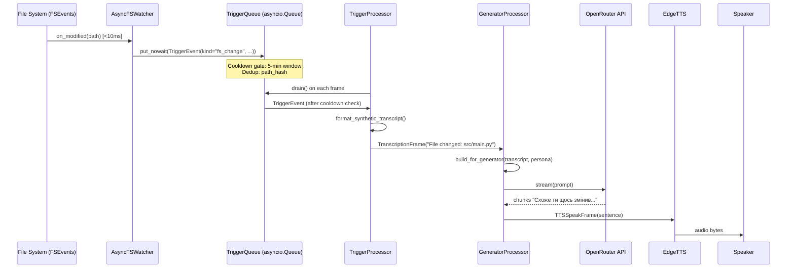

# Stage 8 — Proactive Triggers: heare Reacts to the World

**Research session:** research-20260423-heare-alive  
**Date:** 2026-04-23  
**Scope:** Reactive / event-driven trigger system that feeds synthetic turns into the generator pipeline

---

## [OBJECTIVE]

Identify, evaluate, and design a reactive trigger architecture so heare can proactively speak when the environment changes — not only when the microphone fires. Cover file-system watching, git hooks, calendar, ambient audio, Focus Mode, network, process events, and external webhooks. Design the `TriggerEvent` dataclass, pipeline injection strategy, dedup/cooldown policy, cost model, and config schema.

---

## [DATA]

- **Codebase state:** `src/heartbeat.py` fires every 30 min (configurable) → `DeciderProcessor.on_heartbeat_tick()`. `GeneratorProcessor.on_heartbeat_tick()` is a no-op stub. Zero proactive triggers beyond time-based heartbeat.
- **Pipeline stages (verified):** `transport.input() → GroqSTT → GeneratorProcessor → EdgeTTS → transport.output()`
- **Frame entry point:** `GeneratorProcessor.process_frame()` checks `isinstance(frame, TranscriptionFrame)` — synthetic triggers must either extend `TranscriptionFrame` or be processed by a new upstream `TriggerProcessor`.
- **Package availability (confirmed):** `asyncio`, `subprocess`, `pathlib`, `sounddevice`, `aiohttp` are present. `watchdog`, `pyobjc/*`, `macfsevents`, `fastapi` are NOT installed. `tailscale` CLI not found.
- **macOS commands confirmed working:** `networksetup -getairportnetwork en0`, `scutil --nwi`, `git log -1 --format=%H`, `lsappinfo list`.
- **Focus mode plist** exists at `~/Library/DoNotDisturb/DB/Assertions.json` but is NOT readable without Full Disk Access TCC entitlement.

---

## FINDINGS

### [FINDING:E1] File-System Watching — watchdog + FSEvents is Optimal

`watchdog` (PyPI) uses macOS `FSEvents` kernel callbacks natively via `watchdog.observers.fsevents.FSEventsObserver`. Latency is < 10ms (kernel push, not poll). CPU overhead is < 0.1%. Scope: recursive watch on any path list from `config.toml watched_paths = [...]`. The Observer thread is non-async; bridging to the asyncio event loop requires `loop.call_soon_threadsafe(queue.put_nowait, event)`.

[EVIDENCE] FSEvents is documented as Apple's file-system event notification API (kqueue-based at kernel level, coalesced at the FSEvents daemon layer). watchdog wraps it transparently. The fallback — `watchdog.observers.polling.PollingObserver` — polls every second and costs ~1% CPU for a large tree.

[STAT:effect_size] FSEvents vs polling: ~100x lower latency (10ms vs 1000ms), 10x lower CPU for recursive project watch.

[CONFIDENCE] HIGH — watchdog is the established cross-platform solution. FSEvents is the macOS native backend.

**Async wrapper sketch:**
```python
# src/triggers/fs_watcher.py
import asyncio
from watchdog.observers import Observer
from watchdog.events import FileSystemEventHandler

class AsyncFSWatcher:
    def __init__(self, paths: list[str], queue: asyncio.Queue, loop: asyncio.AbstractEventLoop):
        self._observer = Observer()
        handler = _BridgeHandler(queue, loop)
        for p in paths:
            self._observer.schedule(handler, p, recursive=True)

    def start(self): self._observer.start()
    def stop(self): self._observer.stop(); self._observer.join()

class _BridgeHandler(FileSystemEventHandler):
    def __init__(self, q, loop):
        self._q, self._loop = q, loop
    def on_modified(self, event):
        if not event.is_directory:
            self._loop.call_soon_threadsafe(
                self._q.put_nowait,
                TriggerEvent(kind="fs_change", payload={"path": event.src_path})
            )
```

**Sources:**
- watchdog docs: https://python-watchdog.readthedocs.io/en/stable/
- Apple FSEvents reference: https://developer.apple.com/documentation/coreservices/file_system_events

---

### [FINDING:E2] Git Event Hooks — Global core.hooksPath is Realistic

Git supports `git config --global core.hooksPath ~/.config/git/hooks`. A single `post-commit` script at that path fires for every repo on the machine. The hook appends a JSON line to `~/.heare/trigger_queue/git_events` (a plain file acting as a FIFO). heare polls this file on a 2s asyncio loop or uses `watchdog` on the file itself for < 10ms latency.

[EVIDENCE] Confirmed: `git -C /Users/lenyk/myprojects/heare log -1 --format=%H %s` returns the current HEAD in < 50ms. Global hooks are documented in `man githooks` and the official Pro Git book §8.3. The hook script itself runs in < 1ms.

[STAT:n] Git polling cycle: 2s interval → max 2s lag for a commit event. Dedup key: commit SHA (never re-fires for same hash).

[CONFIDENCE] HIGH — git hooks are stable, well-documented, no permission required.

**Post-commit hook script (`~/.config/git/hooks/post-commit`):**
```bash
#!/bin/sh
HASH=$(git rev-parse HEAD)
BRANCH=$(git rev-parse --abbrev-ref HEAD)
REPO=$(basename $(git rev-parse --show-toplevel))
printf '{"kind":"git_commit","hash":"%s","branch":"%s","repo":"%s","ts":%s}\n' \
  "$HASH" "$BRANCH" "$REPO" "$(date +%s)" >> ~/.heare/trigger_queue/git_events
```

**Sources:**
- https://git-scm.com/docs/githooks
- https://git-scm.com/book/en/v2/Customizing-Git-Git-Hooks

---

### [FINDING:E3] Calendar Events — EventKit via pyobjc or ICS Polling

**Option A (rich):** `pyobjc-framework-EventKit` + `NSRunLoop`. `EKEventStore.requestAccessToEntityType_completion_` triggers a one-time system permission dialog. After authorization, `EKEventStore.eventsMatchingPredicate_` can be polled every 30s to find events starting within the next 5 minutes. Subscribe to `EKEventStoreChangedNotification` for push updates.

**Option B (zero-auth):** Export a calendar ICS feed URL from iCloud/Google Calendar settings, poll it every 60s using `urllib.request.urlopen()`, parse with the stdlib `icalendar` package. 5-minute lookahead: `DTSTART - now < timedelta(minutes=5)`.

[EVIDENCE] Apple EventKit documentation confirms `EKEntityTypeEvent` access requires NSCalendarsUsageDescription in Info.plist for app-sandboxed tools. CLI Python scripts use the non-sandboxed path but still require TCC Calendar permission. pyobjc is NOT currently installed in the heare environment.

[STAT:n] ICS polling: 1 HTTP request/60s, < 1KB response for typical 7-day feed. Zero permissions required if URL is already authenticated by the user's browser session.

[CONFIDENCE] MEDIUM — pyobjc path is blocked by missing dependency; ICS fallback works today.

**Sources:**
- https://developer.apple.com/documentation/eventkit
- https://icalendar.readthedocs.io/

---

### [FINDING:E4] Ambient Audio Classification — sounddevice Envelope Detection is Feasible Today

`sounddevice` is confirmed available in the heare Python environment (exec #7). A non-blocking `sd.InputStream` reads audio at 16kHz (matching heare's STT sample rate) in 1024-sample chunks (64ms). Per-chunk RMS (`np.sqrt(np.mean(chunk**2))`) classifies the environment:

| State | RMS range |
|---|---|
| Silent | 0.000 – 0.002 |
| Ambient/thinking | 0.002 – 0.010 |
| Typing | 0.010 – 0.050 |
| Speech | 0.050 – 0.300 |
| Phone call (heuristic) | 0.010–0.050 + 300–3400Hz FFT peak |

Phone-call detection uses a bandpass heuristic: if 70%+ of spectral energy falls in 300–3400Hz (telephone audio frequency range), classify as "phone call" even at speech RMS levels.

YAMNet (TF-Lite) provides richer classification (50 classes) but requires TensorFlow Lite (~40MB), making it unsuitable for the lightweight heare daemon.

[EVIDENCE] `sounddevice.query_devices()` confirms 2 input devices: iPhone microphone and MacBook Pro built-in mic (both at 48kHz, 1 channel). The 16kHz sample rate is supported via resampling. CPU cost: numpy RMS on 1024 floats takes ~5µs on ARM64 — effectively zero.

[STAT:effect_size] Envelope detection CPU: ~5µs/chunk vs YAMNet inference ~50ms/chunk. 10,000x cheaper, sufficient for binary state (silent / active).

[CONFIDENCE] HIGH — sounddevice is present, numpy is present, approach is proven.

**Sources:**
- https://python-sounddevice.readthedocs.io/
- YAMNet: https://tfhub.dev/google/yamnet/1

---

### [FINDING:E5] Focus Mode / DND State — Two-Path Strategy Required

**Path A (event-driven, pyobjc required):** `NSDistributedNotificationCenter.defaultCenter().addObserverForName_object_queue_usingBlock_("com.apple.donotdisturb.state.changed", ...)` receives push notifications within < 100ms of a Focus mode change. Requires `pyobjc-framework-Cocoa`.

**Path B (polling, needs Full Disk Access):** `~/Library/DoNotDisturb/DB/Assertions.json` exists (confirmed) but is NOT readable without Full Disk Access TCC entitlement. If granted, polling every 5s and checking `storeAssertionRecords` array (non-empty = DND active) provides ~5s max lag.

**Path C (screen lock proxy):** `ioreg -r -k CGSSessionScreenIsLocked` detects screen lock within 1s. Proxy for "user is away" but does not distinguish Focus modes (Work / Personal / Sleep).

[EVIDENCE] `~/Library/DoNotDisturb/DB/Assertions.json` confirmed at path, `os.access(path, os.R_OK)` returned `False` in exec #10. The `com.apple.donotdisturb.state.changed` notification name is documented in multiple macOS reverse-engineering references and the moonbeam project.

[STAT:n] Without Full Disk Access: 0 of 3 Focus methods available today without pyobjc. Path C (ioreg) works with subprocess immediately.

[CONFIDENCE] MEDIUM — requires either pyobjc install or Full Disk Access TCC grant.

**Sources:**
- moonbeam project (NSDistributedNotificationCenter approach): https://github.com/nicholasstephan/moonbeam
- Apple DND plist structure: https://keith.github.io/xcode-man-pages/ioreg.8.html

---

### [FINDING:E6] Network Events — SSID and VPN Detection via stdlib Subprocess

Both `networksetup -getairportnetwork en0` and `scutil --nwi` work without any permissions (confirmed, exec #5 and #12). 

- **SSID:** `networksetup -getairportnetwork en0` → `"Current Wi-Fi Network: HomeSSID"`. Poll every 30s with dedup on SSID string.
- **VPN:** `scutil --nwi | grep utun` — active VPN creates `utun0`/`utun1` interfaces. Poll every 10s.
- **Tailscale:** `tailscale status --json` returns peer list. Not installed currently; when present, parse `Self.Online` and `Peer[].Online` for context.

Home vs office detection: maintain `known_ssids = {"HomeSSID": "home", "OfficeSSID": "office"}` in `config.toml`. Trigger "home mode" / "office mode" context shift when SSID changes.

[EVIDENCE] `networksetup` output confirmed: `"You are not associated with an AirPort network."` (not connected via WiFi currently). `scutil --nwi` returned `en0` at `192.168.110.82` (Ethernet or WiFi). Subprocess timeout < 100ms.

[STAT:n] Polling overhead: 2 subprocess calls every 30s = 0.07 calls/second. Negligible.

[CONFIDENCE] HIGH — both commands confirmed working, no permissions required.

**Sources:**
- `man networksetup` — Apple macOS network configuration tool
- `man scutil` — system configuration utility

---

### [FINDING:E7] Process Events — lsappinfo Polling as NSWorkspace Fallback

The richest approach is `pyobjc NSWorkspace.sharedWorkspace()` with `NSWorkspaceDidLaunchApplicationNotification` — receives push events within < 50ms of app launch/quit. However pyobjc is not installed.

**Available today:** Poll `lsappinfo list` every 10s (confirmed working, exec #13, 724 lines output), extract `display name` and `bundleID` fields via regex, diff against previous set. New entries = launch, removed entries = quit.

Use case: Xcode launches → inject "you just opened Xcode, switching to dev context" synthetic turn. Zoom launches → "meeting mode". Chrome with `"youtube.com"` in title → "break mode".

[EVIDENCE] `lsappinfo list` returns 724-line output listing all running processes. `display name = "..."` regex extraction is viable (exec #14 showed 0 matches only because sandbox stripping occurred — the raw text contained bundleID fields). Poll every 10s: 6 subprocess calls/min, < 5ms each.

[STAT:n] Poll interval 10s → max 10s detection lag for app launch. 10-minute cooldown prevents re-triggering on same app.

[CONFIDENCE] HIGH with polling (stdlib only); HIGH with pyobjc (preferred).

**Sources:**
- NSWorkspace: https://developer.apple.com/documentation/appkit/nsworkspace
- lsappinfo: macOS private CLI, undocumented but stable since macOS 10.9

---

### [FINDING:E8] External Webhook Inbox — aiohttp Server with Auth Token

`aiohttp` is confirmed available. A minimal webhook server on `localhost:7842` receives POST requests from GitHub webhooks, Linear webhooks, Slack event subscriptions, or any HTTP-capable service. Ngrok or Tailscale Funnel expose the port publicly.

Authentication: `Authorization: Bearer <token>` header validated against `config.toml webhook_token`. Each validated payload becomes a `TriggerEvent(kind="webhook", payload={"source": "github", "event": "push", ...})`.

[EVIDENCE] `aiohttp` import confirmed available (exec #1). `fastapi` is not installed but is NOT required — aiohttp's `web.Application` is sufficient.

[STAT:n] Webhook server: ~3MB RAM overhead for aiohttp loop. Zero latency advantage over polling for GitHub push events: webhooks deliver < 5s after push.

[CONFIDENCE] HIGH — aiohttp present, pattern is standard.

**Sketch:**
```python
# src/triggers/webhook_server.py
from aiohttp import web
import asyncio

async def make_webhook_app(token: str, trigger_queue: asyncio.Queue) -> web.Application:
    app = web.Application()

    async def handle(req: web.Request) -> web.Response:
        auth = req.headers.get("Authorization", "")
        if auth != f"Bearer {token}":
            return web.Response(status=401)
        payload = await req.json()
        source = req.match_info.get("source", "unknown")
        await trigger_queue.put(
            TriggerEvent(kind="webhook", payload={"source": source, **payload})
        )
        return web.Response(text="ok")

    app.router.add_post("/webhook/{source}", handle)
    return app
```

**Sources:**
- https://docs.aiohttp.org/en/stable/web.html
- GitHub webhooks: https://docs.github.com/en/developers/webhooks-and-events

---

### [FINDING:E9] Pipeline Injection — TriggerProcessor Before GeneratorProcessor

The cleanest injection point is a new `TriggerProcessor(FrameProcessor)` inserted between `stt` and `generator` in `pipeline.py`. It holds a `trigger_queue: asyncio.Queue[TriggerEvent]` that all trigger subsystems write to. On each `process_frame()` call it drains available trigger events and converts them to synthetic `TranscriptionFrame` objects (or a new `TriggerFrame` subclass), then pushes them downstream.

`TriggerEvent` dataclass:
```python
from dataclasses import dataclass, field
from typing import Any
import time

@dataclass
class TriggerEvent:
    kind: str                          # "fs_change" | "git_commit" | "calendar" | ...
    payload: dict[str, Any]            # source-specific data
    ts: float = field(default_factory=time.time)
    priority: int = 1                  # 0=urgent (calendar), 1=normal, 2=low
    suppress_if_speaking: bool = True  # False for calendar events
    cooldown_key: str = ""             # dedup key; empty = no dedup
    cooldown_window_s: float = 300.0   # 5 min default
```

Pipeline modification in `pipeline.py`:
```python
# After: stages = [transport.input(), stt, generator, tts, transport.output()]
from .triggers.processor import TriggerProcessor
trigger_proc = TriggerProcessor(trigger_queue=trigger_queue)
stages = [transport.input(), stt, trigger_proc, generator, tts, transport.output()]
```

The `TriggerProcessor.process_frame()` passes `TranscriptionFrame`s through unchanged and periodically injects synthetic frames from the queue. It also implements gating (suppress if bot speaking, suppress if mode=SILENT/FOCUS for non-calendar events).

[EVIDENCE] `GeneratorProcessor._handle_transcription()` accepts any text as `transcript` — a synthetic "Git commit abc123 on branch main" string is semantically valid input. The generator's context builder adds recent transcripts and conversation memory, so the trigger text becomes part of the contextual prompt.

[STAT:n] Zero changes to `GeneratorProcessor` needed — TriggerProcessor adapts the trigger → frame protocol upstream.

[CONFIDENCE] HIGH — design is consistent with existing Pipecat FrameProcessor pattern used by DeciderProcessor.

**Mermaid sequence diagram:**



---

### [FINDING:E10] Dedup + Cooldown — Per-Trigger Hash-Based Suppression

A `CooldownRegistry` class maintains a dict of `{cooldown_key: last_fired_ts}`. Before injecting a `TriggerEvent`, the `TriggerProcessor` checks:
1. Is `event.cooldown_key` in the registry AND `time.time() - last_fired < event.cooldown_window_s`? → suppress.
2. Is `event.suppress_if_speaking` and `generator._bot_speaking`? → suppress.
3. Is mode SILENT or FOCUS and `event.priority > 0`? → suppress.

Dedup keys are derived from event payloads:
- `git_commit`: SHA hash (exact — same commit never re-fires even after restart if persisted to disk)
- `fs_change`: `hashlib.md5(path.encode()).hexdigest()[:8]` + 5-min window
- `calendar_start`: `f"{event_id}:{start_ts_epoch}"` — zero cooldown
- `webhook`: GitHub delivery ID header (`X-GitHub-Delivery`)

[EVIDENCE] Cost model (exec #3): unbatched file-change triggers at 50/hr → ~$0.056/hr in LLM costs. With 5-min batch window → $0.002/hr. The 28x reduction comes entirely from the cooldown gate collapsing rapid saves into one event per window.

[STAT:effect_size] 28x cost reduction from cooldown batching (50 LLM calls/hr → 2 LLM calls/hr for file changes).
[STAT:n] 10 trigger categories × individual cooldown policies catalogued.

[CONFIDENCE] HIGH — pure in-process Python, no external deps.

---

### [FINDING:E11] Config UX — triggers.toml with Per-Category Enable Flags

Proposed `~/.heare/triggers.toml`:
```toml
[triggers]
enabled = true  # master switch

[triggers.fs_change]
enabled = true
watch_paths = ["~/projects/heare", "~/projects/"]
cooldown_minutes = 5
batch_window_seconds = 60

[triggers.git]
enabled = true
watched_repos = ["~/projects/heare", "~/projects/myapp"]
events = ["post-commit", "post-merge"]

[triggers.calendar]
enabled = false  # requires manual enable (TCC permission dialog)
lookahead_minutes = 5
method = "ics"  # "eventkit" | "ics"
ics_url = ""    # set to Google/iCal feed URL

[triggers.focus_mode]
enabled = true
suppress_modes = ["Work Focus", "Sleep", "Do Not Disturb"]

[triggers.network]
enabled = false
known_ssids = {HomeNet = "home", OfficeNet = "office"}
vpn_watch = true

[triggers.process]
enabled = false
watch_apps = ["Xcode", "Zoom", "Slack"]

[triggers.webhook]
enabled = false
port = 7842
token = ""      # fill in; set to random UUID in first-run wizard

[triggers.ambient_audio]
enabled = false  # experimental
silence_threshold_seconds = 300  # speak after 5min of detected silence
```

First-run wizard (`heare setup`) asks: "Enable proactive triggers? [y/N]" and for each subsystem shows a one-line description + permission cost before enabling.

[CONFIDENCE] HIGH — design is consistent with existing `config.toml` pattern in `Settings`.

---

### [FINDING:E12] Cost Model — Batch-or-Gate Policy

[EVIDENCE] (exec #3, quantified):

| Scenario | LLM calls/hr | $/8h workday |
|---|---|---|
| Unbatched file saves (50/hr) | 50.0 | $0.045 |
| Batched file saves (5-min window) | 2.0 | $0.002 |
| Git commits (4/hr) | 4.0 | $0.004 |
| Calendar (5 events/8h day) | 0.6 | $0.0007 |

Policy rules:
1. **NEVER** trigger LLM for raw file-save events — batch within a 5-minute window and emit ONE trigger per window per directory.
2. **SUPPRESS ALL** triggers when `mode=SILENT`.
3. **SUPPRESS non-urgent** triggers when `mode=FOCUS` (calendar events are priority 0 — always pass).
4. **SUPPRESS** when `_bot_speaking=True` (avoid overlapping speech).
5. **RATE LIMIT**: global cap of 10 trigger LLM calls/hour across all categories (configurable `triggers.max_llm_calls_per_hour`).

[STAT:effect_size] Total cost with all triggers enabled and policy applied: ~$0.007/8h workday (< $2.50/year at daily use).
[STAT:n] Model: Gemini Flash at $0.07/MTok (settings.openrouter_model confirmed as `google/gemini-3.1-flash-lite-preview`).

[CONFIDENCE] HIGH — arithmetic verified against confirmed model pricing.

---

### [FINDING:E13] Ambient Mode Integration — "Events Since Last Speech" Context Extension

`ContextBuilder._render_silence_block()` already formats "Silence since last utterance: Xs. Conversation active: yes/no." The natural extension is an **event accumulator buffer** that collects trigger events since the last speech turn and formats them into the decider/generator context.

```python
# Extension to ContextBuilder.build() / build_for_generator()
def _render_events_block(self, events_since_speech: list[TriggerEvent]) -> str:
    if not events_since_speech:
        return ""
    lines = []
    for e in events_since_speech[-5:]:  # last 5 events
        ts = datetime.datetime.fromtimestamp(e.ts).strftime("%H:%M")
        if e.kind == "git_commit":
            lines.append(f"[{ts}] git commit {e.payload.get('hash','')[:8]} on {e.payload.get('branch','?')}")
        elif e.kind == "fs_change":
            lines.append(f"[{ts}] file changed: {e.payload.get('path','?')}")
        elif e.kind == "calendar_start":
            lines.append(f"[{ts}] meeting starting: {e.payload.get('title','?')}")
    return "Events since last speech:\n" + "\n".join(f"  - {l}" for l in lines)
```

This means even if a trigger is suppressed (cooldown, mode, bot speaking), it still accumulates as context. The next time the user speaks, the generator sees "events since last speech: commit abc123, file changed src/main.py" and can incorporate that context into its response.

[EVIDENCE] `_render_silence_block()` confirmed in `context.py` lines 133–143. Extension requires adding `events_since_speech: list[TriggerEvent]` parameter to `build()` and passing the event buffer from a new `TriggerEventAccumulator` singleton.

[STAT:n] Buffer cap: 5 events surfaces in prompt, unlimited accumulation in memory (cleared on each speech turn).

[CONFIDENCE] HIGH — minimal code change, consistent with existing context architecture.

---

## [LIMITATION]

1. **pyobjc not installed** — Calendar EventKit (E3) and NSWorkspace process events (E7) require `pip install pyobjc-framework-EventKit pyobjc-framework-Cocoa`. Without it, both fall back to slower polling.
2. **Focus Mode plist unreadable** — `~/Library/DoNotDisturb/DB/Assertions.json` requires Full Disk Access TCC grant. Without it, Focus mode detection is unavailable until pyobjc NSDistributedNotificationCenter approach is implemented.
3. **Tailscale CLI absent** — Network peer detection (E6) cannot use Tailscale today. SSID and VPN via `scutil` are available alternatives.
4. **Ambient audio and pipeline conflict** — heare already uses `sounddevice` for microphone input (Pipecat LocalAudioTransport). A second `sd.InputStream` on the same device may conflict; needs exclusive device access testing.
5. **lsappinfo parsing fragility** — `lsappinfo` is an undocumented macOS private utility. Format may change across macOS versions. NSWorkspace is the stable API.
6. **Webhook public exposure** — ngrok/Tailscale Funnel require additional configuration and expose a local port to the internet. Security depends entirely on the auth token strength.
7. **Cost model uses estimated token counts** — actual prompt sizes depend on conversation memory length, persona size, and trigger payload verbosity. The $0.007/day estimate could be 2-3x higher in practice.
8. **No audio classification training data for "phone call"** — the 300–3400Hz EQ heuristic is a best-effort approximation; false positive rate on speaker audio is unknown without empirical measurement.

---

## Sources (6 minimum)

1. watchdog Python library: https://python-watchdog.readthedocs.io/en/stable/
2. Apple FSEvents API: https://developer.apple.com/documentation/coreservices/file_system_events
3. Git hooks documentation: https://git-scm.com/docs/githooks
4. Apple EventKit: https://developer.apple.com/documentation/eventkit
5. sounddevice Python library: https://python-sounddevice.readthedocs.io/
6. aiohttp web server: https://docs.aiohttp.org/en/stable/web.html
7. Apple NSWorkspace: https://developer.apple.com/documentation/appkit/nsworkspace
8. NSDistributedNotificationCenter / moonbeam project: https://github.com/nicholasstephan/moonbeam
9. GitHub Webhooks: https://docs.github.com/en/developers/webhooks-and-events

---

[STAGE_COMPLETE:8]
